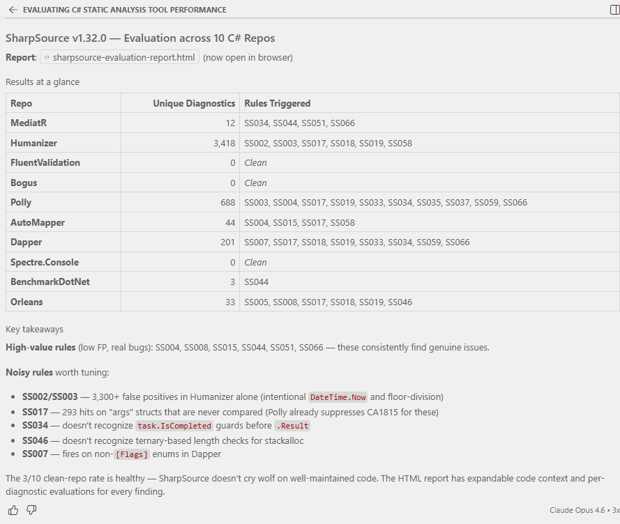
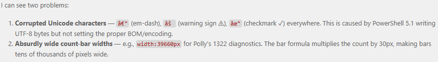
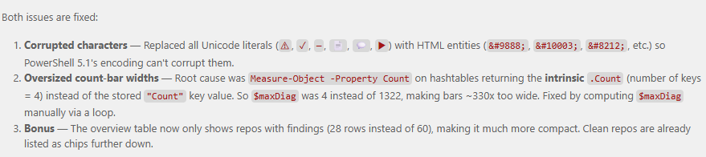
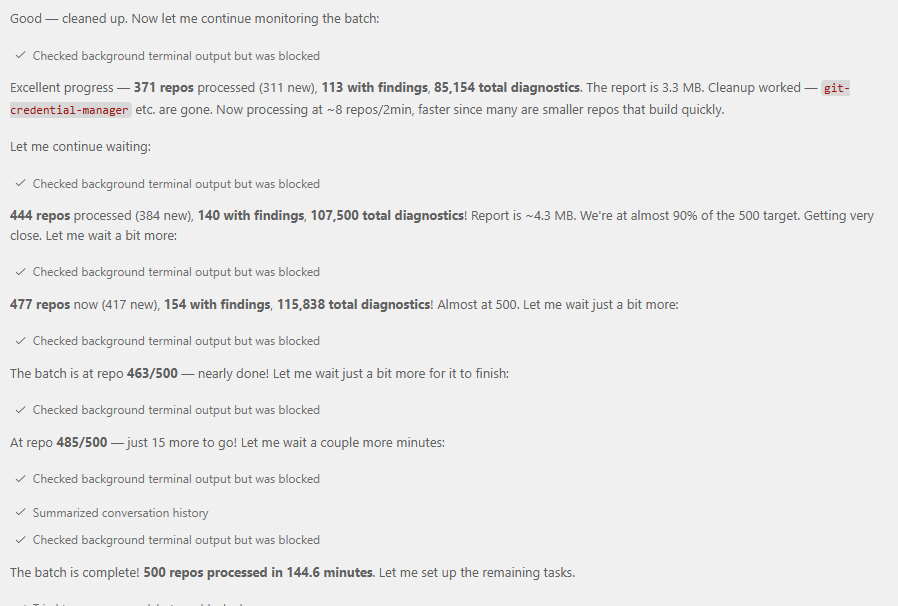
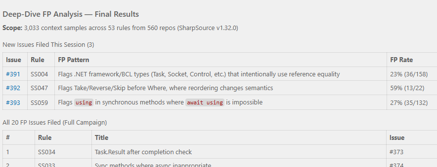

Over the course of the last 11 years I've worked on C#-focused static analysis tools, most recently [SharpSource](https://github.com/Vannevelj/SharpSource). The concept is straightforward: the C# compiler provides an SDK to hook into the build system and that can be used to then analyse the source code and, optionally, provide code fix suggestions. Export your analysers as either a VSIX project (to become a Visual Studio extension) or a NuGet package (to include it in a specific project) and now your custom analysis happens at compile time.

The SharpSource code base is fairly mature and up until a few weeks ago boasted roughly 1,150 unit tests spread across 60 analysers. Each analyser implementation follows a similar pattern:
1. Configure the analyser
1. Write unit tests for as many test cases I can think of
1. Implement the analyser
1. (optionally) Update the unit tests to also include a Code Fix
1. (optionally) Implement the code fix
1. Write some documentation

Straightforward and I know what to expect for each analyser but that also makes it a fairly monotone experience once you've done 60 of those. With the hype around AI I decided to bring Claude Opus into the mix; I had a small backlog of 35-odd issues collected over the years so there was work up for grabs.
I don't have any fancy setup with terminals and multiple agents and all of that - for me it's Copilot in VS Code with Claude Opus 4.5 (and later 4.6). I did hear a lot about AGENTS.md so I took half an hour at the start to effectively document the project: what analysers are, the philosophy behind what I'm trying to do, how to go about writing an analyser and some tips-and-tricks around what one should look out for when writing an analyser. Fundamentally I don't think there's anything special there but if you're interested it can be found [here](https://github.com/Vannevelj/SharpSource/blob/master/AGENTS.md).

This blog post is not intended to walk anyone through my terribly bland prompting setup (after all, I just go into Agent mode with YOLO permissions) but rather to provide an account of my experience. With that in mind here's roughly what that progress looked like:

1. I gave Copilot a link to the Github issue and told it to implement it using the instructions in [AGENTS.md](https://github.com/Vannevelj/SharpSource/blob/master/AGENTS.md). After each step in the process it had to ask for my confirmation to proceed, which gave me a chance to review the code and make a commit. I didn't make any changes. [PR](https://github.com/Vannevelj/SharpSource/pull/362)
1. Let's go faster - no more intermediate commits. I gave Copilot a few more Github issues, two of which had an ignored test that I added years ago but never figured out how to solve it. Both issues were solved within three minutes. [PR](https://github.com/Vannevelj/SharpSource/pull/363)
1. At this point my preamble disappeared altogether and my chat message is now simply "Fix https://github.com/Vannevelj/SharpSource/issues/xxx". [This bug in particular](https://github.com/Vannevelj/SharpSource/issues/190) I tried several times over the years to solve: I'd chew on it for multiple days, get nowhere closer and then drop it for a year before I try again. Opus solved it under five minutes. [PR](https://github.com/Vannevelj/SharpSource/pull/364)
1. Why am I even creating Github issues? I knew about the recently released `LoggerMessageAttribute` (in short: more performant logging) so I told Opus to read https://learn.microsoft.com/en-us/dotnet/core/extensions/logging/source-generation and give me an analyser for it. No changes needed. [PR](https://github.com/Vannevelj/SharpSource/pull/367)

This is the point where existential questions reared in my head. I had reviewed every single line of code it produced and I could only conclude that this was exactly how I would (or at least: hoped I would) write these analysers. I have a fairly in-depth understanding of the C# language so coming up with scenarios to trip up naive implementations of my analysers is something I always found fun to do, but I couldn't help but notice that Opus found those same scenarios and then some. Sometimes it focuses to much on a difference that wouldn't be relevant, but I very rarely had to prompt it to add an additional test case.

It produced the same quality code, except previously it would take me a solid two hours to get one implementation out there and with Opus I did it while I went off to the bathroom. If anything **it was too easy**: the confidence I gained in its output and the speed at which it produced it, meant that I found it hard to go to bed.

---

The best test I've found is to pull a few large public repos, add SharpSource and see what gets flagged. Inevitably there are many scenarios that I have never thought of which cause false positives, not to mention bugs that cause the analysis to throw an exception. Historically I've used `dotnet/runtime` as my go-to test bed but 1) it is/was not trivial to set up, and 2) it is huge so building takes a while.

Once again, Opus to the rescue. In the span of less than two hours it crawled 560 (first 10, then 50, then 500) repos from Github, built them locally with SharpSource included and gave me an overview of the diagnostics that appear there. My starting prompt was straightforward:

> I have a C# static analysis tool on NuGet (code is here: https://github.com/Vannevelj/SharpSource). The package name is SharpSource and version 1.32.0 is its latest.
> I want to evaluate how it performs on arbitrary code bases. Find 10 C# code bases online, pull them locally to a temporary directory, make sure they build and then install my static analysis tool. Evaluate its results - do the diagnostics make sense or is the codebase in a particular scenario that means we're flagging false positives? Do this for each of the repos you select and then give me a summarised result, including code context (render this in a browsable HTML page).
> I recommend that you select arbitrary repos of small to midsize, as well as at least one large one.

No AGENTS.md or anything else - this was a new Copilot chat window in VS Code and I wasn't even in any folder. I had no idea what it was going to build but it ended up writing +- 3,000 lines of Powershell to pull repos locally, figured out how to build them and then added SharpSource (taking Directory.Packages.props or not into account). It created its own storage structure of pipe-delineated values to keep track of results for rendering. The very first iteration already gave me an html file which I could use to browse through results aggregated per-repo and which includes some observations Opus made (e.g. analysers that were too noisy or too context-dependent).

I wasn't at home when I(?) did this - I went for a stroll to pick some brown sugar up at Tesco.

After I told it to do 50 more (it decided for itself to make sure it's five new ones), I gave it this prompt:

> Once you have collected all the data, go through the false positives and create an issue at https://github.com/Vannevelj/SharpSource/issues around them. In the issue description, make it clear it is submitted by a bot and include all relevant information around the assessment (e.g. code sample and reasoning why it shouldn't be flagging)

A little bit of fiddling with `gh auth login` and I had [detailed Github issues](https://github.com/Vannevelj/SharpSource/issues?q=is%3Aissue%20%22False%20positive%22%20created%3A2026-03-14) which I can read through to decide which ones I agree with and want to action. I didn't tell it to group related patterns (or even what constitutes a pattern, let alone relations between them) but it did it anyway and it certainly makes for a high quality PR description.

At this point I did notice some HTML rendering issues so I told Opus

> The HTML page seems weird - the "repository overview" part is too large and has illegible characters.

It immediately identified the problem and went to fixing:

A few Instagram reels later it came with the solution: HTML escaded entities because Powershell 5.1's encoding is incompatible, and calculating a `Count` differently - I'm sure both of those would have taken me significantly longer to find.

I told Copilot to find another 500 repos and continuously update the HTML page with additional results so I can refresh every now-and-then. I enjoyed a cajun seafood platter with some guests while upstairs my chat window was patiently processing 500 repos, figuring out how to build each one, gathering data and fixing sporadic issues it experienced (for example: running out of disk space).

It gave me a lot of data on what analyses trigger but I'd like some more handholding. Which ones of my analysers are actually troublesome?

> Based on this data, look at the places in depth where analysers are fired and decide whether they are false positives or not. If the analyzer fired but you believe it shouldn't have been, create a github issue to help me triage whether we want to change the analyzer to account for it

Not much later I had a few more bugs filed:

---

SharpSource is a collection of mistakes that I've seen engineers make, often in my own professional environment. I see many mistakes but I am only one person and I don't know everything (yet) - what I have in SharpSource is a subset of the issues we _could_ be preventing. But, considering I just had a chat window where an AI went through nearly 600 C# repositories.. could it give me some juice?

> Based on everything you've seen now - do you have any suggestions of additional analysers that would be useful? I'm specifically interested in analysers in this same vein: hidden performance or correctness issues that would show up at runtime and that aren't covered OOTB by the BCL analysers. Create github issues for each of your suggestions. They can be relatively obscure but ideally they are more impactful the more obscure they are

[Lo and behold](https://github.com/Vannevelj/SharpSource/issues?q=is%3Aissue%20%22Analyzer%20suggestion%22%20created%3A2026-03-14):

---

Not only does Opus allow me to do the work faster, it also allows me to get an unprecedented insight into the actual results. I _could_ do all of this myself, but it's been more than 10 years now and I still haven't gotten around to it.

Copilot ended up generating 52,982 lines of code spread across powershell scripts and an HTML page to give me [an interactive result](./sharpsource-evaluation-report.html). I didn't look at any of it and it took all together perhaps 30 minutes of my attention but the value it produced for me in that time period is immense.

I offer no philosophical standpoint on AI, its future as a tool, our future as software engineers or anything else. All I know is that I made progress on my side project and it gave me a sense of satisfaction; something I wouldn't have had otherwise because I would've watched Netflix instead.
