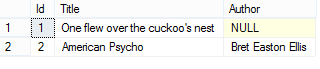
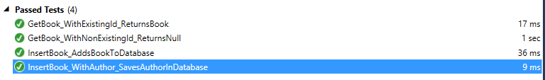

# Introduction

If you have ever needed to use a database in C# then chances are you ended up with Entity Framework as an ORM layer. It allows you to query the database with LINQ rather than explicit SQL queries making for a much more comfortable data layer. However if you’re also the kind of person that likes (has?) to write tests then you might have noticed that the DbContext class is rather annoying to work around.

Personally I am not a fan of mocking at all: it requires a lot of setup work which pollutes the test and it makes your code brittle (if the mock is configured to return X but you change the implementation to return Y, the tests will still work despite the discrepancy with the actual implementation).

The idea behind what you will read is straightforward: instead of using an actual database hosted locally or on Azure, we’ll create one in-memory for each test. This allows us to test each layer of our project in a fast manner without having to resort to creating a fake implementation of our actual code. There is a thin line between unit testing and integration testing that we may cross here but I don’t consider this a problem: fast, reliable and clean tests get precedence over ideologism in any scenario.

The first part of this article will take you through the steps to setup a generic project that uses Entity-Framework so if you want to go straight to implementing your tests, skip to part 2.

Without further ado, let me take you through the process of getting Entity-Framework in a testable state.

# Setting up the solution
Create a new solution with a class library (“Database”) and a unit test project.

The former will be where we talk to the database and the latter will contain our tests.

## Add the `Book` model and the `IBookRepository` interface.


```csharp
public class Book
{
    public Book() { }

    public Book(string title)
    {
        Title = title;
    }

    public int Id { get; set; }
    public string Title { get; set; }
}

public interface IBookRepository
{
    Book Get(int id);
    void Insert(Book book);
}
```

## Install Entity-Framework in your class library project and add your `DbContext` implementation.

```csharp
public class LibraryContext : DbContext
{
    public LibraryContext() { }

    public DbSet<Book> Books { get; set; }
}

public class LibraryContext : DbContext
{
    public LibraryContext() { }

    public DbSet<Book> Books { get; set; }
}
```

## Execute `Enable-Migrations` on your class library project.

Entity-Framework Migrations allows us to keep the database up-to-date with the model used in our code. You can find more information about this here.

## Implement `IBookRepository`.

This will be a very basic implementation. I’m using constructor injection to pass in the right context to make sure the caller always passes in an object (for our own sake, let’s assume people don’t pass in null values.

```csharp
public class BookRepository : IBookRepository
{
    private readonly LibraryContext _context;

    public BookRepository(LibraryContext context)
    {
        _context = context;
    }

    public Book Get(int id)
    {
        return _context.Books.SingleOrDefault(x => x.Id == id);
    }

    public void Insert(Book book)
    {
        _context.Books.Add(book);
        _context.SaveChanges();
    }
}
```

# Configuring the project for testing
## Create the Unit Test project.

Add a reference to your class library project so you can use the `LibraryContext` object you created.

## Install Effort.EF6 in your test project.

This library contains the magic that makes all this possible: Effort will allow us to easily create a new database in-memory. You’ll notice that it adds additional references to Entity-Framework and NMemory which basically describes its purpose already.

## Create an additional `LibraryContext` constructor.

This constructor will allow us to pass in the connection created by Effort. Note the importance of the second parameter to be true: “The connection will not be disposed when the context is disposed if `contextOwnsConnection` is false“. Obviously we don’t want that connection to linger around when the context is already disposed, that would mean a lot of left-over trash. You’ll notice soon that the connection we create is explicitly chosen to be disposed after every test run, guaranteeing a clean test each time we run it.


```csharp
public LibraryContext(DbConnection connection) : base(connection, true)
{

}
```


## Implement tests.

These three tests are basic and show how little you actually have to change your testing approach to use this. What catches the eye is `DbConnectionFactory.CreateTransient()`. The corresponding documentation is clear enough:

“Creates a `DbConnection` object that rely on an in-memory database instance that lives during the connection object lifecycle. If the connection object is disposed or garbage collected, then underlying database will be garbage collected too.”

You can see that our connection object is created in the `Initialize()` method and passed to the `LibrayContext` and subsequently the `BookRepository`. In essence this means that, since the connection is local and the context and repository are overwritten after each test, the connection and database will be disposed after each test. This results in entirely separated database instances for each test.

Note that for the tests I used FluentAssertions.


```csharp
[TestClass]
public class BookRepositoryTests
{
    private LibraryContext _context;
    private IBookRepository _repository;

    [TestInitialize]
    public void Initialize()
    {
        var connection = DbConnectionFactory.CreateTransient();
        _context = new LibraryContext(connection);
        _repository = new BookRepository(_context);
    }

    [TestMethod]
    public void GetBook_WithNonExistingId_ReturnsNull()
    {
        // Arrange
        const int nonExistingId = 155;

        // Act
        var book = _repository.Get(nonExistingId);

        // Assert
        book.Should().BeNull();
    }

    [TestMethod]
    public void InsertBook_AddsBookToDatabase()
    {
        // Arrange
        const string title = "To kill a mocking bird";
        var book = new Book(title);

        // Act
        _repository.Insert(book);

        // Assert
        _context.Books.Should().HaveCount(1);
        _context.Books.First().Should().NotBeNull();
        _context.Books.First().Title.Should().Be(title);
    }

    [TestMethod]
    public void GetBook_WithExistingId_ReturnsBook()
    {
        // Arrange
        var book = new Book("To kill a mocking bird");
        _repository.Insert(book);

        // Act
        var retrievedBook = _repository.Get(book.Id);

        // Assert
        book.Title.Should().Be(retrievedBook.Title);
        book.Id.Should().Be(retrievedBook.Id);
    }
}
```

## InvalidOperationException

Of course, there just had to be problems along the way otherwise anyone would be using this already. The first one you’ll get it this:

“`System.InvalidOperationException`: Migrations is enabled for context ‘`LibraryContext`’ but the database does not exist or contains no mapped tables. Use Migrations to create the database and its tables, for example by running the ‘`Update-Database`’ command from the Package Manager Console.”

Evidently this is irrelevant to us since the entire idea behind our approach is that we don’t have a database to start with but instead create it each test. Entity-Framework notices it has migrations planned because it sees the configuration present in our Migrations folder so we can use this information to work around the issue: simply create a new Class Library project and move your Migrations folder to it. If you execute your tests again you will notice that they now all pass.

## Didn’t you just break the Migration configuration?

Yes, I did. You can verify this (and do so to follow along) by adding a Console Application project and adding a reference to the “Database” project and Entity-Framework.
Afterwards, add some test code to use as your actual implementation:

```csharp
public static void Main(string[] args)
{
    var context = new LibraryContext();
    var bookRepository = new BookRepository(context);
    bookRepository.Insert(new Book("One flew over the cuckoo's nest"));
    Console.WriteLine(string.Join("\n", context.Books.Select(x => x.Title)));
    Console.Read();
}
```

If you now test your program with an actual implementation you’ll notice you might receive an `InvalidOperationException`. This happens because you don’t have a reference to EntityFramework.SqlServer in your console application project. Use the Reference Manager tool to manually browse to this dll and add it to your project. I prefer to take one from the bin folder in my “Database” project for ease but you might want to place it in a folder dedicated to sharing dll’s in your project.

Add a reference to the EntityFramework.SqlServer dll

Once this is done, you can now use the database with your existing model. But what happens when we want to add a field `Author` to it? Our Migrations configuration is dead so we’ll have to fix that first.

## Update the model.

We’ll slightly update our `Book` model to account for an optional `Author` parameter like this:


```csharp
public class Book
{
    public Book()
    {
    }

    public Book(string title, string author = null)
    {
        Title = title;
        Author = author;
    }

    public int Id { get; set; }
    public string Title { get; set; }
    public string Author { get; set; }
}
```


## Re-configuring Migrations

You’ll notice that if you now try to add a new migration, the Package Manager Console will only display errors: “The EntityFramework package is not installed on project ‘Migrations’.” and “No migrations configuration type was found in the assembly ‘Database’” depending on which project you target with your command.

First of all: install Entity-Framework in the Migrations project. If you now try to call `Enable-Migrations` it will tell you that it can’t find a context type inside this project (which is true, it’s in our “Database” project). Luckily we can specify the project in which it should look!

If you now use `Enable-Migrations -ContextProjectName "Database" -Force` it will configure Migrations with the context it finds in “Database”. The -Force is there to overwrite the existing Migration we moved to the Migrations project.

We can now add our changes using `Add-Migration "author field"` and a subsequent `Update-Database`.

Looking at the database we can see it added a new column to it.
If we change our console application a little bit to insert a book with an author specified, we see it works perfectly:

```csharp
public static void Main(string[] args)
{
    var context = new LibraryContext();
    var bookRepository = new BookRepository(context);
    bookRepository.Insert(new Book("American Psycho", "Bret Easton Ellis"));
    Console.WriteLine(string.Join("\n", context.Books.Select(x => x.Author + ": " + x.Title)));
    Console.Read();
}
```


In order to verify our tests still work just fine we add a fourth that tests whether a book with author can be inserted:

```csharp
[TestMethod]
public void InsertBook_WithAuthor_SavesAuthorInDatabase()
{
    // Arrange
    const string author = "Bret Easton Ellis";
    var book = new Book("American Psycho", author);

    // Act
    _repository.Insert(book);

    // Assert
    _context.Books.Should().HaveCount(1);
    _context.Books.First().Author.Should().NotBeNull();
    _context.Books.First().Author.Should().NotBeEmpty();
    _context.Books.First().Author.Should().Be(author);
}
```


Lo and behold: all tests pass without having to change anything in the test project; we can immediately test the changes in our model. Also notice how incredibly quick the tests have finished, taking into account that we basically recreated the database 4 times. Aside from a little warmup time, tests are executed pretty much instantly.




# Conclusion
This article describes how you can create an in-memory database identical to the one in production and use it to test your exact interaction. Whether or not that is something you should want to do in the first place is up to you but I believe it very useful, certainly when there is more complicated logic inside your repositories. This is an important piece of code that should be tested but mocking is brittle at best in my eyes.

You can tell from the tests I’ve shown that there is very, very little noise in your tests which is an entirely different thing when you have to use mocks to return the correct data from every method call. It also prevents you from forgetting about mocking certain intertwined method calls which would then suddenly return faulty data because they use an actual implementation rather than one controlled by your testing environment. Effort makes sure this isn’t an issue since your entire test environment is under control by default.

If you’re interested in empirical evidence: I’ve used this in a small ASP.NET Web Api project with around 300 end-to-end tests (REST call comes in -> Interact with database -> Return data). Each of these tests created a new isolated database, interacted with it in some way and verified the responses that were returned. The overall execution time of the test suite was around 5 seconds.

All things considered I am a big fan of using this method to bypass mocks and verify the interaction with the database works as it should.