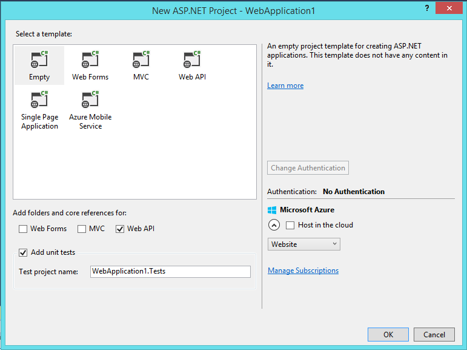

# Introduction

Let’s talk about routing. If you’ve ever developed a web application then you know the hassle you have with the constant “Resource not found” or “Multiple actions match the request” errors. What if I told you you could fix all this without ever having to open a browser?

That’s right: we’ll unit-test our routes! As an added bonus I’ll also show how you can unit-test parameter validation since that’s probably one of the most important things to do when creating a (public) API.

# Setting up the environment
## Create a new Web API project




We don’t need any sort of hosting so you can just leave Azure unchecked. We’ll use ASP.NET MVC in our test project but not in the Web API itself so you can just use an empty project with Web API checked.

## Create a model and backing repository

I will not go into deeper detail about a proper repository implementation but if you’re interested, you can always check my post about unit-testing Entity-Framework for more information about that layer of your project.

```csharp
public class Book
{
    public Book()
    {
    }

    public Book(int id, string title, string author)
    {
        Id = id;
        Title = title;
        Author = author;
    }

    [Required]
    public int Id { get; set; }

    [Required]
    public string Title { get; set; }

    [Required]
    public string Author { get; set; }
}

public class BookRepository
{
    private readonly IList<Book> _books = new List<Book>();

    public BookRepository()
    {
        _books.Add(new Book(1, "American Psycho", "Bret Easton Ellis"));
        _books.Add(new Book(2, "The Lord of the Rings", "J.R.R. Tolkien"));
        _books.Add(new Book(5, "Le Petit Prince", "Antoine de Saint-Exupéry"));
    }

    public Book Get(int id)
    {
        return _books.SingleOrDefault(x => x.Id == id);
    }

    public void Insert(Book book)
    {
        _books.Add(book);
    }
}
```

## Implement a basic controller

Now that we’ve got that out of the way, let’s create our controller with a few API endpoints.

```csharp
[RoutePrefix("api/books")]
public class BookController : ApiController
{
    private readonly BookRepository _bookRepository = new BookRepository();

    [Route("{id:int}")]
    [HttpGet]
    [ResponseType(typeof (Book))]
    public IHttpActionResult GetBook([FromUri] int id)
    {
        var book = _bookRepository.Get(id);
        if (book == null)
        {
            return NotFound();
        }

        return Ok(book);
    }

    [Route("")]
    [HttpPost]
    [ResponseType(typeof (void))]
    public IHttpActionResult InsertBook([FromBody] Book book)
    {
        if (ModelState.IsValid)
        {
            _bookRepository.Insert(book);
            return Ok();
        }

        var errors = string.Join("\n", ModelState.Values.SelectMany(x => x.Errors.Select(y => y.ErrorMessage)));
        return BadRequest(errors);
    }
}
```

By specifying the `[RoutePrefix]` attribute on class level, we essentially end up with “`api/books/{id}`” and “`api/books`” as API endpoints. The `[ResponseType]` attribute has no functional difference but is used when generating documentation. Personally I prefer to always add it considering the actual return type is hidden behind the `IHttpActionResult`.

# Set up the test environment

I like to use MVC Route Tester for this. As the name implies it is focused on ASP.NET MVC but works just fine for ASP.NET Web Api as well. Use NuGet to add `MvcRouteTester.Mvc5.2`, `FluentAssertions` and Microsoft ASP.NET MVC to your test project.

## Creating our first tests
Now that the entire environment is setup, let’s take a look at a basic test. What we’ll do here is verify that our routing configuration has a route configured that corresponds with what we expect AND calls the method we expect it to. Let’s take a look at the code:

```csharp
[TestClass]
public class UnitTests
{
    private HttpConfiguration _configuration;

    [TestInitialize]
    public void Initialize()
    {
        _configuration = new HttpConfiguration();
        WebApiConfig.Register(_configuration);
        _configuration.EnsureInitialized();
    }

    [TestMethod]
    public void GetBook_WithCorrectRoute_CallsAppropriateMethod()
    {
        const string route = "/api/books/5";
        RouteAssert.HasApiRoute(_configuration, route, HttpMethod.Get);
        _configuration.ShouldMap(route).To<BookController>(HttpMethod.Get, x => x.GetBook(5));
    }

    [TestMethod]
    public void InsertBook_WithCorrectRoute_CallsAppropriateMethod()
    {
        const string route = "/api/books";
        RouteAssert.HasApiRoute(_configuration, route, HttpMethod.Post);
        _configuration.ShouldMap(route).To<BookController>(HttpMethod.Post, x => x.InsertBook(null));
    }
}
```

You’ll notice that we have to create a new `HttpConfiguration` object. This type’s name already conveys what it’s about: it contains the configuration of your HTTP server. The only aspect we care about is its routing purposes so we can just create an empty config without setting any properties. Once that is done, we inject it into our WebApi project by calling `WebApiConfig.Register(HttpConfiguration)` which you can find under the `App_Start` folder. Since it’s just a basic project it will generate the routes by mapping the attributes and the default route.

The contents of the tests are straightforward: first we test whether such a route exists and after that whether it is mapped to the correct method. Notice how it doesn’t matter what argument you pass in to `BookController.InsertBook(Book)`: whether it’s `null` or `new Book()` won’t make a difference although you should be more wary about this when you have a scenario involving method overloading.

## What about constraints?

New in Web Api 2 are Route constraints. You’ve already seen one of them in the form of `{id:int}` which indicates that only requests routing to that URL form and where the id can be parsed as an integer should be handled by that method.
As a way of showcasing this behaviour and proving that it can be tested, I will add two additional endpoints which take care of respectively the ids above 15 and below 15.

```csharp
[Route("myaction/{someInteger:int:min(15)}")]
[HttpGet]
[ResponseType(typeof (void))]
public IHttpActionResult SomeSensibleConstraint([FromUri] int someInteger)
{
    return Ok();
}

[Route("myaction/{someInteger:int:max(15)}")]
[HttpGet]
[ResponseType(typeof (void))]
public IHttpActionResult AnotherSensibleConstraint([FromUri] int someInteger)
{
    return BadRequest();
}
```

Testing is as easy as ever:

```csharp
[TestMethod]
public void SomeSensibleConstraint_WithValidCriteria_CallsAppropriateMethod()
{
    const string route = "/api/books/myaction/25";
    RouteAssert.HasApiRoute(_configuration, route, HttpMethod.Get);
    _configuration.ShouldMap(route).To<BookController>(HttpMethod.Get, x => x.SomeSensibleConstraint(25));
}

[TestMethod]
public void SomeSensibleConstraint_WithInvalidCriteria_CallsAppropriateMethod()
{
    const string route = "/api/books/myaction/10";
    RouteAssert.HasApiRoute(_configuration, route, HttpMethod.Get);
    _configuration.ShouldMap(route).To<BookController>(HttpMethod.Get, x => x.AnotherSensibleConstraint(10));
}
```

## What about parameter validation testing?

One last important aspect to testing your API is verifying user input. One thing to realize here is that the ASP.NET framework does a lot for us when we deploy our website. You’ve already noticed that we explicitly have to create the `HttpConfiguration` object and inject that in our `WebApiConfig`. Now we’ll drop that aspect since we’ll not be testing what ASP.NET does but we still have to use some of its functions, more specifically the ability to validate the incoming object.

Luckily this can be done extremely easy by calling `ApiController.Validate(object)` which will look at each field and its attributes to determine validity.

```csharp
[TestMethod]
public void InsertBook_WithoutTitle_ReturnsBadRequest()
{
    // Arrange
    var controller = new BookController();
    var book = new Book
    {
        Id = 3,
        Author = "J. K. Rowling"
    };

    // Act
    controller.Configuration = _configuration;
    controller.Validate(book);
    var response = controller.InsertBook(book) as BadRequestErrorMessageResult;

    // Assert
    response.Should().NotBeNull();
}
```

# Conclusion
That concludes this short overview on how to unit-test your public API. While some might argue the use of testing your routes I like the fact that I can be certain all of that works without even having to fire up my browser once. Certainly when you start with conditional routing this can be a very convenient way to make sure everything works as intended. The tests are executed very fast and take very little time to write which makes it all the more worth it.