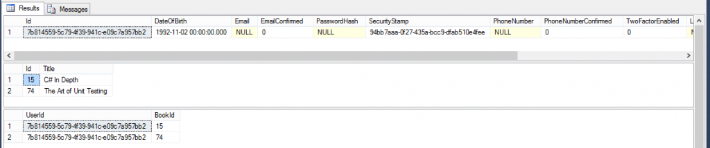

# Introduction

I am getting accustomed to the ASP.NET Identity framework and let me just say that I love it. No more boring hassle with user accounts: all the traditional stuff is already there. However often you’ll find yourself wanting to expand on the default `IdentityUser` and add your own fields to it. This was my use case as well here and since I couldn’t find any clear instructions on how this is done exactly, I decided to dive into it especially for you! Well, maybe a little bit for me as well.


---


The example will be straightforward: extend the the default user by adding a property that holds his date of birth and a collection of books. For this there are two simple classes:

```csharp
public class Book
{
    public Book() { }

    public Book(int id, string title)
    {
        Id = id;
        Title = title;
    }

    public int Id { get; set; }
    public string Title { get; set; }
}

public class ApplicationUser : IdentityUser
{
    public ApplicationUser()
    {
        Books = new List<Book>();
    }

    public ApplicationUser(string username) : base(username)
    {
    }

    public DateTime? DateOfBirth { get; set; }
    public virtual ICollection<Book> Books { get; set; }
}
```

The `Book` class is straightforward. The `ApplicationUser` class isn’t very complex either: inherit from `IdentityUser` to get the default user implementation. Furthermore there is the `MyContext` class which contains two tricky aspects:

```csharp
public class MyContext : IdentityDbContext<ApplicationUser>;
{
    public MyContext() : base("MyTestContext")
    {
        Database.Log = msg => Debug.WriteLine(msg);
    }

    public DbSet<Book> Books { get; set; }

    protected override void OnModelCreating(DbModelBuilder modelBuilder)
    {
        base.OnModelCreating(modelBuilder);

        modelBuilder.Entity<Book>().ToTable("Books");
        modelBuilder.Entity<Book>().HasKey(x => x.Id);
        modelBuilder.Entity<Book>().Property(x => x.Id).HasDatabaseGeneratedOption(DatabaseGeneratedOption.None);

        modelBuilder.Entity<ApplicationUser>().HasMany(x => x.Books).WithMany().Map(x =>
        {
            x.ToTable("UserBooks");
            x.MapLeftKey("UserId");
            x.MapRightKey("BookId");
        });
    }
}
```

First of all: notice how we inherit from `IdentityDbContext<ApplicationUser>`. The specialized `DbContext` is important because it provides us with all the user-related data from the database and the `ApplicationUser` type parameter is important because it defines what type the `DbSet<T>` Users will be defined as. Before I found out there was a generic variant of the context, I was trying to make it work with the non-generic type and separating user and userinformation: not pretty.

The second important aspect here is `base.OnModelCreating(modelbuilder)`. If you do not do this, the configuration as defined in `IdentityDbContext` will not be applied. Since this isn’t necessary with a plain old `DbContext`, I figured it worth mentioning since I for one typically omit this call.

Finally all there is left is demonstrating how this is used exactly. This too is straightforward and requires no special code:

```csharp
public class Program
{
    public static void Main(string[] args)
    {
        AsyncContext.Run(() => MainAsync(args));
        Console.WriteLine("End of program");
        Console.Read();
    }

    public static async Task MainAsync(string[] args)
    {
        var books = new[] { new Book(15, "C# In Depth"), new Book(74, "The Art of Unit Testing") };
        var context = new MyContext();
        var manager = new UserManager<ApplicationUser>(new UserStore<ApplicationUser>(context));
        var user = new ApplicationUser("Jeroen456")
        {
            DateOfBirth = new DateTime(1992, 11, 02),
            Books = books
        };
        await manager.CreateAsync(user);
    }
}
```

Notice how I use [AsyncEx by Stephen Cleary](https://github.com/StephenCleary/AsyncEx) to create an asynchronous context in my console application. After this you simply create a manager around the store which you pass your context to and voilà: your user is now inserted and everything works perfectly.



You can see the date of birth is in the same table (²AspNetUsers²) as all other user-related data. The second table displays the books and the third the many-to-many table between users and books.

---

All things considered it is fairly straightforward as to how it works but there are a few tricky aspects that make you scratch your head if you’re not too familiar with the framework yet.