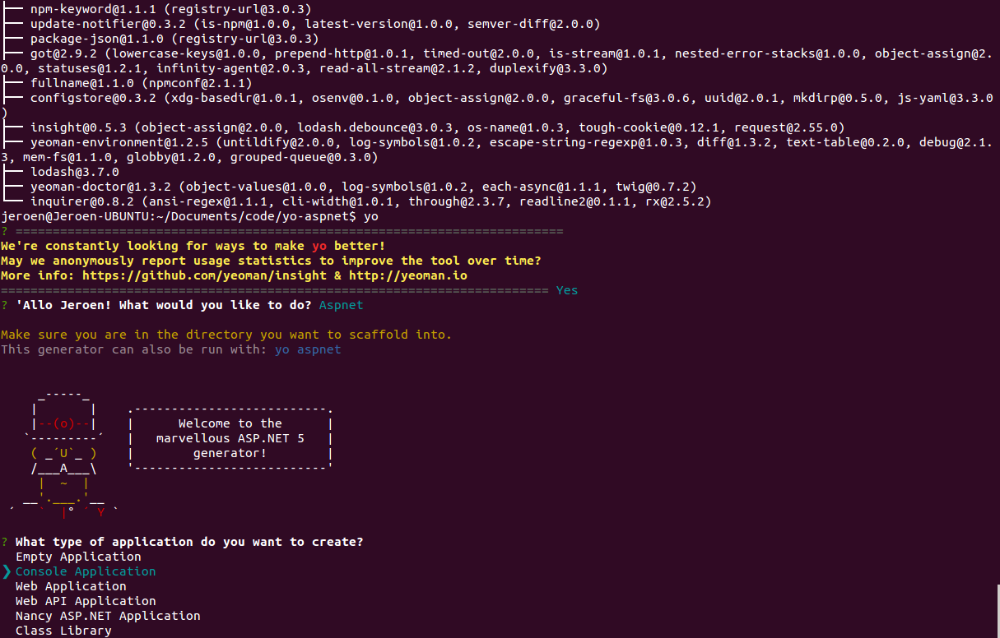
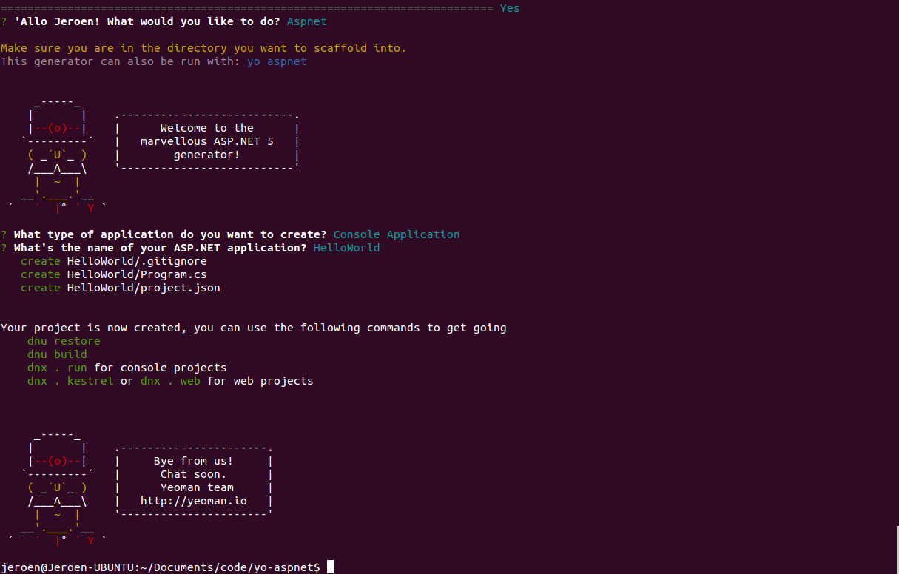
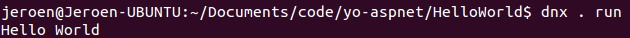

# Introduction

Like many other .NET developers I have been following the Build conference that’s going on right now. One of its biggest announcements (so far) was the release of Visual Studio Code and the accompanying CoreCLR for Linux and Mac. It sounds nice and all but I wanted to try this out myself. I have decided to get a Console Application working in Ubuntu 14.04 since we’ve all seen by now how to deploy an ASP.NET web application. While reading this post, keep in mind that I have basically never used Linux so it’s possible I took hoops that shouldn’t have been taken. In case I did, leave me a comment so I can learn from it. Note that in this blogpost I will be using the Mono runtime and not the .NET Core one. At the time of writing there was only documentation available for the former however you can always get started with .NET Core here.

One of the things I am pleasantly surprised with is that there are several Yeoman templates available to create a solution structure. Whereas Visual Studio does that for you, it would have been a serious pain to have to do this yourself each time you create a new project in Visual Studio Code.

Without further ado, let’s get to it!

# The setup
I installed Ubuntu 14.04 on an old laptop, which means it’s an entirely fresh installation. If you have already been using Linux and/or Mono then you probably know what steps you can skip.

We start by following the instructions [here](http://docs.asp.net/en/latest/getting-started/installing-on-linux.html). You can see that we follow the ASP.NET documentation even though we’re building a Console Application: the setup for either is very, very similar with just about two commands differently.

```
sudo apt-key adv --keyserver keyserver.ubuntu.com --recv-keys 3FA7E0328081BFF6A14DA29AA6A19B38D3D831EF
```

```
echo "deb http://download.mono-project.com/repo/debian wheezy main" | sudo tee /etc/apt/sources.list.d/mono-xamarin.list
```

```
sudo apt-get update
```

```
sudo apt-get install Mono-Complete
```

Afterwards it’s time to install the DNVM. For more information about the .NET Version Manager you can take a look [here (Github)](https://github.com/aspnet/home) and [here (MSDN)](http://blogs.msdn.com/b/dotnet/archive/2015/04/29/net-announcements-at-build-2015.aspx).

```
curl -sSL https://raw.githubusercontent.com/aspnet/Home/dev/dnvminstall.sh | DNX_BRANCH=dev sh && source ~/.dnx/dnvm/dnvm.sh
```

Next up is NodeJS. This will allow us to install Yeoman and in turn generate the project templates.

```
sudo apt-get install nodejs
```

```
sudo apt-get install npm
```

One problem I had here was that there was [a naming conflict between node and nodejs](https://stackoverflow.com/q/21168141/1864167) which are apparently different packages. This is solved by executing

```
sudo apt-get install nodejs-legacy
```

# Creating the solution
Afterwards create your own directory where we store our project. I did this in `$HOME/Documents/code/yo-aspnet`.

Now that we have this we can generate our project structure by first installing yo:

```
sudo npm install -g yo
```

and subsequently the generator:

```
sudo npm install -g generator-aspnet
```

When this is done, it’s time to pick the kind of project template we want to generate. Start yo

```
yo
```

and you will be prompted to select the kind of application you’re interested in. You should see a screen like this:


Use the arrows keys to select “Console Application” and press enter. Give your project a name (in my case: “HelloWorld”) and everything should now have been created:



Notice how it’s a very minimal template and only consists of a gitignore, a main class and the project configuration file. There is no `AssemblyInfo`, no `bin`/`obj` folders, no `app.config`, etc.

More information about the generator can be found [here](https://www.npmjs.com/package/generator-aspnet).

# Installing Visual Studio Code
Time to get that new editor up and running!

Go to https://code.visualstudio.com and download the zip file. Navigate to your Downloads folder and create a folder which will hold the unzipped content. I just left this in Downloads, you might as well put this elsewhere (which you probably should if you use Linux properly).

```
mkdir VSCode
```

```
unzip VSCode-linux-x64.zip -d VSCode
```

```
cd VSCode
```

And start the editor with

```
./Code
```

Here’s one tricky thing: if you now look at Visual Code, there’s a good chance you’re seeing something like
> Cannot start Omnisharp because Mono version >=3.10.0 is required

When you look at your own installed Mono version (`mono --version`) you’ll notice that you have 3.2.8 installed. Likewise if you now try to execute the HelloWorld app, you will receive `TypeLoadException` errors.

Luckily this can be easily solved: install the `mono-devel` package. This will overwrite your installed Mono with version 4.0.1 which is released just yesterday and everything will work flawlessly.

```
sudo apt-get install mono-devel
```

# Executing the Console application
There’s just one last thing left to do: create a .NET execution environment and execute our app.

First create a default execution environment:

```
dnvm upgrade
```

and execute the app (from the directory where `Program.cs` is contained):

```
dnx . run
```

You should now see Hello World printed out!


