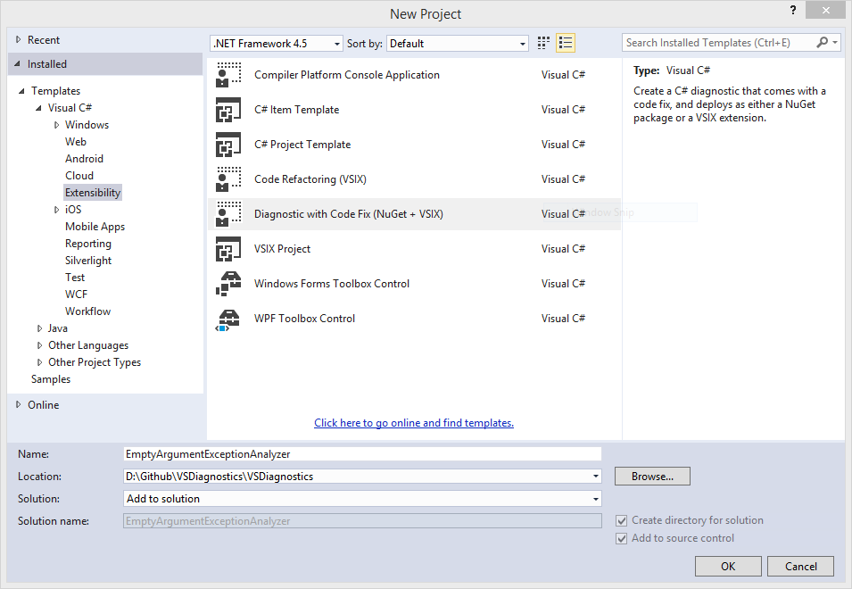

# Introduction

With the release of Visual Studio 2015 RC, we also received the pretty much final implementation of the Diagnostics implementation. This SDK allows us to create our own diagnostics to help us write proper code that’s being verified against those rules in real-time: you don’t have to perform the verification at a separate build-step. What’s more is that we can combine that with a code fix: a shortcut integrated in Visual Studio that provides us a solution to what we determine to be a problem.

This might sound a little abstract but if you’ve been using Visual Studio (and/or Resharper) then you know what I mean: have you ever written your classname as `myClass` rather than `MyClass`? This is a violation of the C# naming conventions and visual studio will warn you about it and provide you a quick-fix to turn it into a proper capitalized word. This is exactly the behaviour we can create and which is integrated seemlessly in Visual Studio.

I gave this a go exactly 1 year ago but decided against continuing because there wasn’t a final version of it yet and it was really cumbersome to test. That combined with the fact that it was hardly usable (not many people had Visual Studio 2015 yet) made me wait until it had matured and was properly supported. Luckily, it seems that time has finally come.

# The setup
In order to get started you need a few things installed:

* [Visual Studio 2015 RC](https://www.visualstudio.com/en-us/downloads/visual-studio-2015-downloads-vs.aspx)
* [Visual Studio 2015 RC SDK](https://www.visualstudio.com/en-us/downloads/visual-studio-2015-downloads-vs.aspx) (Same link as above but at the bottom of the page, go to Additional Tools -> Visual Studio 2015 SDK RC)
* [.NET Compiler Platform SDK Templates for RC](https://visualstudiogallery.msdn.microsoft.com/e2e07e91-9d0b-4944-ba40-e86bcbec1599)
You will notice that each of these downloads are specific for the RC version, which is what I’m using at the time of writing. Make sure that you don’t mix up CTP-X, RC and RTM versions since that is bound to create issues.

# Creating an Analyzer
Even though the official template says “Diagnostic and CodeFix”, the term “Analyzer” is used equally, if not more, as “diagnostic”. I don’t believe there are hard conventions on this yet so use what you feel more natural. I personally prefer to append “Analyzer” to my.. diagnostics.

In Visual Studio, create a new project (and a solution if needed) using the “Diagnostic with Code Fix (NuGet + VSIX)” template, found under “Extensibility”. This immediately indicates a very useful feature: you will be able to distribute your analyzers using NuGet and/or you can choose to distribute them as an installable extension instead. This makes it very easy to deploy in your environment and share it with others should you want to.




Now on to the real work: we will create an analyzer that shows a warning when we throw an `ArgumentException` without passing a parameter to it. The use of this is that we will make sure that we’re never just going to throw such an exception without specifying what argument is being annoying in the first place.

After your template is created you will notice 3 projects in the solution: a portable class library which contains your analyzers and code fix providers, a test project and an extension project. You can ignore the latter one and we’ll focus on the first two.

When you look at your analyzer you see an entire example for you to start from. The nature of the diagnostic we will create however is such that we will analyze a syntax node, not a symbol. The code we implement is very straightforward:

```csharp
[DiagnosticAnalyzer(LanguageNames.CSharp)]
public class EmptyArgumentExceptionAnalyzer : DiagnosticAnalyzer
{
   public const string DiagnosticId = "EmptyArgumentExceptionAnalyzer";
   internal const string Title = "Verifies whether an ArgumentException is thrown with a message.";
   internal const string MessageFormat = "ArgumentException is thrown without a message.";
   internal const string Category = "Exceptions";
   internal const DiagnosticSeverity Severity = DiagnosticSeverity.Warning;
   internal static DiagnosticDescriptor Rule = new DiagnosticDescriptor(DiagnosticId, Title, MessageFormat, Category, Severity, true);
   public override ImmutableArray<DiagnosticDescriptor> SupportedDiagnostics => ImmutableArray.Create(Rule);

   public override void Initialize(AnalysisContext context)
   {
       context.RegisterSyntaxNodeAction(AnalyzeSyntaxNode, SyntaxKind.ThrowStatement);
   }

   private static void AnalyzeSyntaxNode(SyntaxNodeAnalysisContext context)
   {
       var throwStatement = context.Node as ThrowStatementSyntax;
       if (throwStatement == null)
       {
           return;
       }

       var expression = throwStatement.Expression as ObjectCreationExpressionSyntax;
       if (expression == null)
       {
           return;
       }

       var symbolInformation = context.SemanticModel.GetSymbolInfo(expression.Type);
       if (symbolInformation.Symbol.MetadataName != "ArgumentException")
       {
           return;
       }

       if (!expression.ArgumentList.ChildNodes().Any())
       {
           context.ReportDiagnostic(Diagnostic.Create(Rule, expression.GetLocation()));
       }
   }
}
```

I’ve disregarded globalization because it is an extra hurdle to readability and I don’t expect my project to ever become popular enough that it warrants different languages to be supported. Aside from that you’ll notice that I also used a lovely expression Body for the `SupportedDiagnostics` method.

The first thing I did was register my analyzer on a a syntax node, a `throw` statement to be precise. This evidentely means that each time a `throw` statement is encountered when the tree is walked through, my analyzer will execute.

The actual implementation is very straightforward:

* Verify the node is a throw statement
* Verify the expression creates a new object
* Verify the new object is of type ArgumentException
* Verify there are no arguments passed to the constructor
And that’s it. If these 4 conditions are true, I believe there to be an empty `ArgumentException` call and I report a warning on that location.

# Testing the analyzer
If you now set the Vsix project as your startup project and press the big green “Start” button, a new Visual Studio instance will be launched. Use it to create a new project and you will notice that your analyzer is included. You can now let yourself loose on all sorts of scenarios involving `ArgumentExceptions`!

However I wouldn’t be me if I didn’t look into unit testing instead. Luckily, this is very easily done with this release. In fact, it’s so easy that there’s really not much looking into: you create a test class that inherits from `CodeFixVerifier`, override the `GetCSharpDiagnosticAnalyzer` and `GetCSharpCodeFixProvider` as needed, you write source code in plain text and you use the helper functions `VerifyCSharpDiagnostic` and `VerifyCSharpCodeFix` to assert whether or not a diagnostic/code fix should occur at the given position. If nothing should occur you just pass in the source code as a string and if you do expect something, you pass in a `DiagnosticResult`.

In code:

```csharp
[TestClass]
public class UnitTest : CodeFixVerifier
{
   [TestMethod]
   public void EmptyArgumentExceptionAnalyzer_WithEmptyArgument_InvokesWarning()
   {
       var test = @"
using System;
using System.Text;

namespace ConsoleApplication1
{
   class MyClass
   {
       void Method(string input)
       {
           throw new ArgumentException();
       }
   }
}";

       var expected = new DiagnosticResult
       {
           Id = EmptyArgumentExceptionAnalyzerAnalyzer.DiagnosticId,
           Message = EmptyArgumentExceptionAnalyzerAnalyzer.MessageFormat,
           Severity = EmptyArgumentExceptionAnalyzerAnalyzer.Severity,
           Locations =
               new[]
               {
                   new DiagnosticResultLocation("Test0.cs", 11, 23)
               }
       };

       VerifyCSharpDiagnostic(test, expected);
   }

   [TestMethod]
   public void EmptyArgumentExceptionAnalyzer_WithArgument_DoesNotInvokeWarning()
   {
       var test = @"
using System;
using System.Text;

namespace ConsoleApplication1
{
   class MyClass
   {
       void Method(string input)
       {
           throw new ArgumentException(input);
       }
   }
}";
       VerifyCSharpDiagnostic(test);
   }

   [TestMethod]
   public void EmptyArgumentExceptionAnalyzer_WithDumbRethrowStatement_DoesNotInvokeWarning()
   {
       var test = @"
using System;
using System.Text;

namespace ConsoleApplication1
{
   class MyClass
   {
       void Method(string input)
       {
           try { }
           catch (ArgumentException e) { throw e; }
       }
   }
}";

       VerifyCSharpDiagnostic(test);
   }

   [TestMethod]
   public void EmptyArgumentExceptionAnalyzer_WithRethrowStatement_DoesNotInvokeWarning()
   {
       var test = @"
using System;
using System.Text;

namespace ConsoleApplication1
{
   class MyClass
   {
       void Method(string input)
       {
           try { }
           catch (ArgumentException e) { throw; }
       }
   }
}";

       VerifyCSharpDiagnostic(test);
   }

   protected override DiagnosticAnalyzer GetCSharpDiagnosticAnalyzer()
   {
       return new EmptyArgumentExceptionAnalyzer();
   }
}
```

That’s how easy it now is to create your own slim ReSharper. Your code is evaluated against your rules as you type, you can write them yourself very easily and you can export them as needed. I will definitely port the few analyzers I created as a test last year and expand it with many others I can think of and I encourage you to do the same (or contribute).

For more information on how to get started with these analyzers I recommend a couple of resources:

* http://channel9.msdn.com/Series/ConnectOn-Demand/225
* https://www.wintellectnow.com/videos/watch?videoid=writing-roslyn-analyzers-and-code-fixes