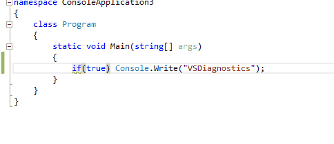
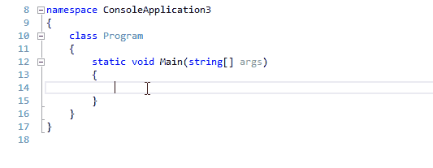
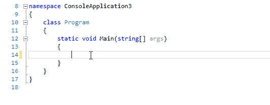
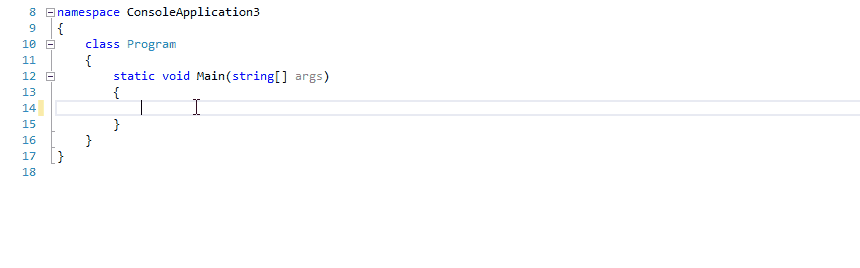
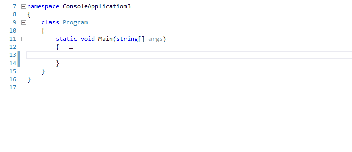
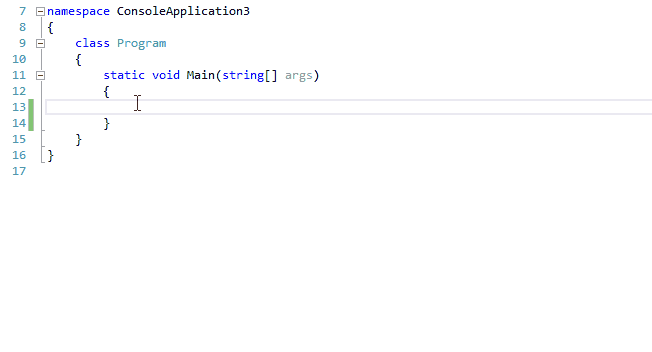

I am happy to announce the first release of [VSDiagnostics](https://github.com/Vannevelj/VSDiagnostics)! This project is a group of diagnostics meant for Visual Studio 2015 and up which will help the developer adhere to best practices and avoid common pitfalls.

These are a few examples of the scenarios currently supported:

## `if` statements without braces

##  `String.Empty` instead of an empty string

##  `ArgumentException` that can use `nameof()`

##  A `catch` clause that catches a `NullReferenceException`

##  Throwing an empty `ArgumentException`

##  Catching `Exception` without other `catch` clauses

And many more!

For the full list, take a look at [the Github page](https://github.com/Vannevelj/VSDiagnostics). If you have a suggestion in mind or you are interested in contributing, let me know: I want this to be a community powered project. I hope this first release already proves helpful to you and I’m eager to hear your feedback and criticism.

# How do I use this?
Simply create a new project using Visual Studio 2015 RC and add [the NuGet package](https://www.nuget.org/packages/VSDiagnostics/0! If you don’t find it: make sure you’re also looking in the NuGet V2 package source.