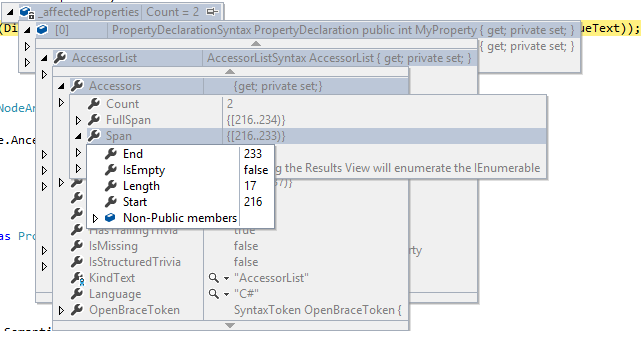
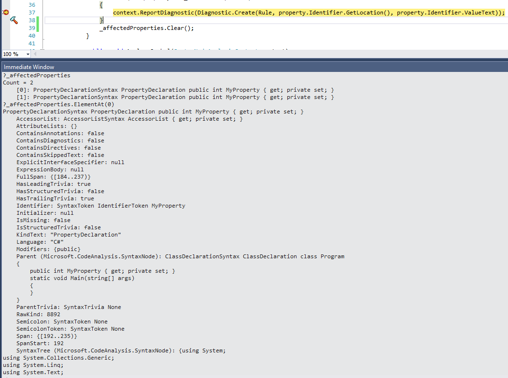

Ever wanted a quick overview of an element in debug mode? If you want to know a value a couple of layers deep, you soon have something like this:

This poses several annoyances:

* You have to keep your mouse within boundaries.
* It obstructs your code.
* You have to scroll to see all properties.
* You can’t do anything else.

An alternative which I very much like is `?`. That’s right, a simple question mark. Use this in combination with your immediate window and it will print out all the data you normally get from hovering. For example as you can see in the image below: `?_affectedProperties` will show me the string representation of the list. I can also use more complicated expressions like `?_affectedProperties.ElementAt(0)` to get the detailed info of deeper layers.

Also worth mentioning is [Object Exporter](https://marketplace.visualstudio.com/items?itemName=OmarElabd.ObjectExporter) which is an extension that does this for you.