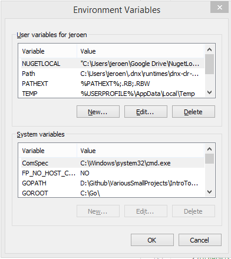
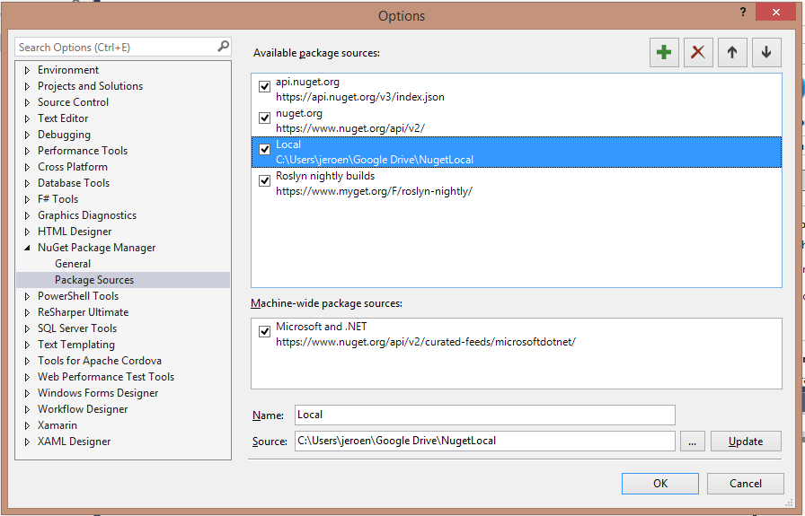
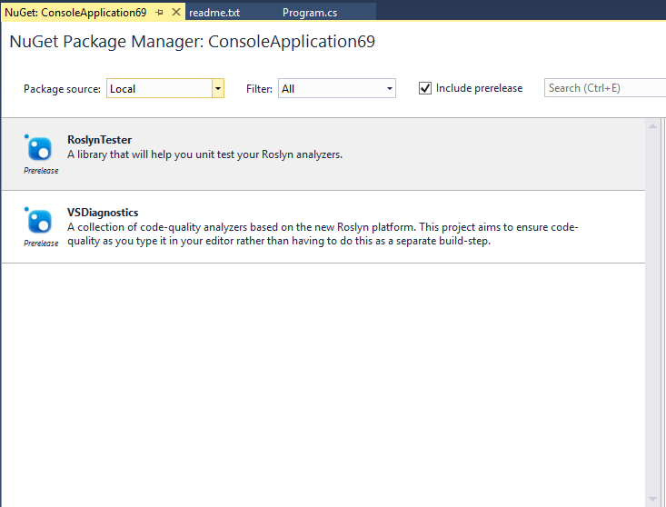

# Introduction
MSBuild can be a very powerful tool to handle, well, your build process. I will say up front that I haven’t got much experience with it but the little experience I do have, tells me that there are many possibilities to customize your workflow.

The situation that brought me in closer contact with MSBuild is the following: when you create a new project using the Diagnostic with Code Fix template, it will also include a .nuspec file. This file contains the metadata needed to release something on NuGet (name, description, version, release notes, dependencies, etc). It will essentially package your nuspec file into a nupkg file which can in turn be used to publish it onto some feed of your choice. The code in question is the following:

```xml
<PropertyGroup>
    <PostBuildEvent>if exist Diagnostic.nuspec if exist "$(SolutionDir)\packages\NuGet.CommandLine.2.8.2\tools\NuGet.exe" "$(SolutionDir)\packages\NuGet.CommandLine.2.8.2\tools\NuGet.exe" pack Diagnostic.nuspec -OutputDirectory .</PostBuildEvent>
    <RunPostBuildEvent>OnOutputUpdated</RunPostBuildEvent>
</PropertyGroup>
```

What happens is straightforward: if there is a file called `Diagnostic.nuspec` and `NuGet.exe` is packaged with our project, call `NuGet.exe` and pack the nuspec file into the root directory.

# Local feeds
One of the features of NuGet is that it can retrieve packages from different sources and not just the official nuget.org feed. This is particularly interesting because we can also point to a local folder as our NuGet source! Doing so allows us to manually verify everything works with the NuGet package by using it locally and only publishing it after we are satisfied. However I'm not interested in having to create a separate feed for each project (remember that the OutputDirectory specifies the project root folder).

One more restriction to keep in mind: I don’t want to localize my project’s build structure to work on just my machine. Anyone should be able to pull the repo and get started which means I can’t just hardcode a directory in the MSBuild script.

The problem: how do you create a local NuGet feed that gets the latest version of a NuGet package as soon as I build it, in a location of my choice while keeping other devs in mind?

# The solution
The solution I came up with (through some nods on SO) is very straightforward: if a certain environment variable is set, use that variable’s value as the output directory. If it’s not set, use the root. This makes sure that by-default, people will have the same behaviour as a clean project. Only when you want custom behaviour, you should change it. I liked this result a lot because it meant that the project could still be pulled and built cleanly without having to do additional configuration steps (nobody likes doing that for a project you haven’t even started yet).

I added an environment variable with key `NUGETLOCAL` and value `"C:\Users\jeroen\Google Drive\NugetLocal\VSDiagnostics"` to my user-level system variables. Note that I added quotes around the value!


All that’s left now is adapting the .csproj file to account for this alternative action:

```xml
<Choose>
    <When Condition=" $(NUGETLOCAL) != '' ">
        <PropertyGroup>
            <PostBuildEvent>if exist Diagnostic.nuspec if exist "$(SolutionDir)\packages\NuGet.CommandLine.2.8.2\tools\NuGet.exe" "$(SolutionDir)\packages\NuGet.CommandLine.2.8.2\tools\NuGet.exe" pack Diagnostic.nuspec -OutputDirectory $(NUGETLOCAL)</PostBuildEvent>
        <RunPostBuildEvent>OnOutputUpdated</RunPostBuildEvent>
    </PropertyGroup>
    </When>
    <Otherwise>
        <PropertyGroup>
            <PostBuildEvent>if exist Diagnostic.nuspec if exist "$(SolutionDir)\packages\NuGet.CommandLine.2.8.2\tools\NuGet.exe" "$(SolutionDir)\packages\NuGet.CommandLine.2.8.2\tools\NuGet.exe" pack Diagnostic.nuspec -OutputDirectory .</PostBuildEvent>
            <RunPostBuildEvent>OnOutputUpdated</RunPostBuildEvent>
        </PropertyGroup>
    </Otherwise>
</Choose>
```

The code speaks for itself: if the value retrieved from the `NUGETLOCAL` environment variable is not empty (aka: it has a value), use that as output directory. If it’s empty, use the root.

All that’s left now is setting up the local NuGet feed. You’ll notice that I pointed it to the /Google Drive/NugetLocal folder so I’ll do exactly that under Tools -> Options -> NuGet Package Manager -> Package Sources:



Using that feed is now a matter of selecting the correct package source in the NuGet package manager and all local feeds from that folder will show up:

