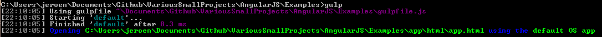

# Introduction
I figured it’s about time I get a little more experienced with AngularJS. I want to create a website for my project [VSDiagnostics](https://github.com/Vannevelj/VSDiagnostics) and I plan on working with this technology at my internship, so it’s time to jump on the hype train.

What you’ll read here is just a quick overview of setting up gulp and Visual Studio Code to get your first AngularJS app working.

# Download Visual Studio Code
This is our editor of choice. If you prefer to use something else then that’s fine — anything that can write plain text files is fine, really. I would suggest [Notepad++](https://notepad-plus-plus.org/) or [Sublime Text](http://www.sublimetext.com/) as an alternative.

[Visual Studio Code](https://code.visualstudio.com/)

# Install NodeJS
The Node Package Manager (npm) will help us retrieve all the dependencies we’re interested in. Likewise, if you ever want to add a NodeJS backend — this will be needed.

# Create a directory structure
I created my folder structure like this:

```
|-- Examples
      |------- app
                |---- js
                      |---- app.js
                |---- html
                      |---- app.html
```

# Write code
I’m working through a book on AngularJS myself so the little bit of AngularJS code here is just the first two examples shown in that book. It’s a simple demonstration of model-binding — a powerful feature of the AngularJS framework.


```html
<!DOCTYPE html>
<html ng-app>

<head>
    <title>Hello world</title>
    <script src="https://ajax.googleapis.com/ajax/libs/angularjs/1.2.6/angular.js"></script>
</head>

<body>
    <div ng-controller="MyController">
        <input ng-model="name" type="text" placeholder="Your name" />
        <h1>Hello {{ name }}</h1>
        <h1>Hello {{ clock }}</h1>
    </div>

    <script type="text/javascript" src="../js/app.js">

    </script>
</body>

</html>
```

```js
function MyController($scope) {
    $scope.clock = new Date();
    var updateClock = function () {
        $scope.clock = new Date();
    };
    setInterval(function () {
        $scope.$apply(updateClock);
    }, 1000);
    updateClock();
};
```

Once all this is done, I bet you’re interested to see what we just created. However if you’ll look around in the Visual Studio Code IDE, you’ll notice that there is no ‘run’ button or anything similar to it.

What there is, however, is a possibility to run a ‘task’. It might be best explained on the official documentation:

> Lots of tools exist to automate tasks like building, packaging, testing or deploying software systems. Examples include Make, Ant, Gulp, Jake, Rake and MSBuild. These tools are mostly run from the command line and automate jobs outside the inner software development loop (edit, compile, test and debug). Given their importance in the development lifecycle, it is very helpful to be able run them and analyze their results from within VS Code.

Here you can use whichever you like most (and is appropriate). I personally decided on Gulp for no particular reason: it’s a funny word and I vaguely recall using it in a class some time ago.

# Running a task
In order to start a task (which in our scenario will consist of simply firing up our browser with the app we’re creating), you have to search for it. In VS Code, pres the key combination `[Ctrl]` + `[Shift]` + `[P]`. If you now search for ‘run task’, you will notice that it gives you the option to choose “**Tasks: Run Task**”, but with nothing to select from the dropdown menu.

In order to create our task, we have to get started with Gulp first. With Gulp we will define our task after which it will be available to us in the beforementioned dropdown menu.

# Initializing package.json
`Package.json` is essentially your npm configuration. It contains metadata about your application like name, version, author as well as dependencies, files, etc. You could do without it but that would mean our dependencies wouldn’t be saved along with the application (and I do like that)!

In order to do so, issue the following commands:

```
    $ cd C:\Users\Jeroen\Documents\AngularJS\Examples
    $ npm init
```

You will now have to enter some information to setup the package.json file and after that we can get started (and finished) with Gulp.

# Installing Gulp
We need two Gulp-related packages to do what we want it to do: Gulp and Gulp-Open. The first one will provide the general Gulp environment while the second one will provide a way for us to open the browser.

The following commands will install these packages:

```
    $ npm install --global gulp
    $ npm install --save-dev gulp
    $ npm install --save-dev gulp-open
```

# Setting up gulpfile.js
Now it’s time to create our Task. In order to do so, go to your project’s root folder (in my case: `\Examples\`) and create a new file called `gulpfile.js`.

Afterwards, add the following contents:

```js
var gulp = require('gulp');
var open = require('gulp-open');

gulp.task('default', function () {
    gulp.src('./app/html/app.html').pipe(open());
});
```

What it does is simple: create a new task called ‘default’ and make it open the `app.html` file. This will prompt you for the default program to open .html files with (if you didn’t have that set already) and subsequently open it with that program.

# Launching the browser
The last step is simply executing the given task. You have two options here: either you use the beforementioned `[Ctrl]` + `[Shift]` + `[P]` method which will spawn a second window with some console output, or you simply enter `$ gulp` in the command prompt at the location of your gulpfile.

This will give you an output that resembles this



and also opens `app.html` in your favorite browser.