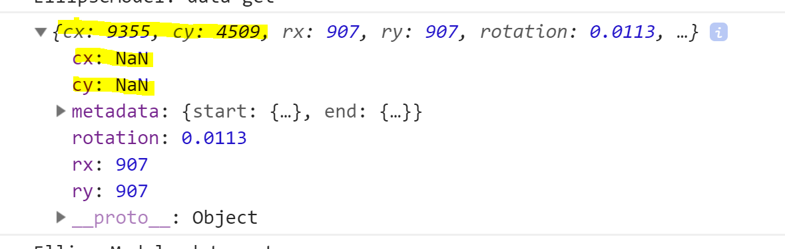
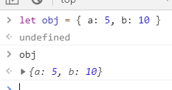
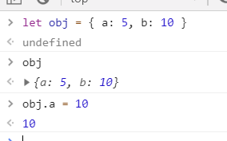
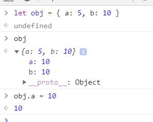

While debugging with some `console.log` statements I noticed that the values logged seemed to differ from what they initially said. Upon uncollapsing the log entry it would consistently show a `NaN` value for some property values while it clearly stated the proper value above it.

As it turns out this is caused by Chrome re-evaluating the object with the data it has at the moment you uncollapse it rather than just showing you what the values were at that moment in time. There is a small info icon that does aim to explain this behaviour but its wording does not really clarify the most important aspect, which is that it re-evaluates it without the original context.

We can quickly verify this behaviour ourselves by defining an object, logging it and making a change to the object prior to uncollapsing:

Change a value on the object:

If we now uncollapse the previous log statement, we can see it got re-evaluated based on our current context

Interestingly it looks like the evaluation is only done on the first collapse: subsequent alterations to the property and collapsing/uncollapsing does not change the existing log statement.