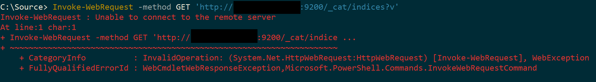
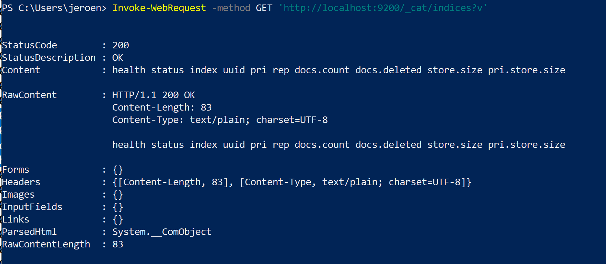

After I set up ElasticSearch on a Windows Server 2019 VM in Azure, I noticed that I could query the instance from the VM itself but not from outside of it.



The solution to expose it was two-fold: 
1. Assign `network.host`
2. Assign `discovery.seed_hosts`

Without the latter, you will find an error like this in your logs (`C:\ProgramData\Elastic\Elasticsearch\logs`):

```
[2019-05-26T15:55:43,504][INFO ][o.e.b.BootstrapChecks    ] [rapide] bound or publishing to a non-loopback address, enforcing bootstrap checks
[2019-05-26T15:55:43,519][ERROR][o.e.b.Bootstrap          ] [rapide] node validation exception
[1] bootstrap checks failed
[1]: the default discovery settings are unsuitable for production use; at least one of [discovery.seed_hosts, discovery.seed_providers, cluster.initial_master_nodes] must be configured
```

These values worked for me:
```
network.host: 0.0.0.0
discovery.seed_hosts: ["127.0.0.1", "[::1]"]
```

I verified it worked by executing the following request. Change `<IP>` with `localhost` if you test on the VM or the VM's public IP if you execute it outside of it.

```
Invoke-WebRequest -method GET 'http://<IP>:9200/_cat/indices?v'
```

The output should look something like this:

