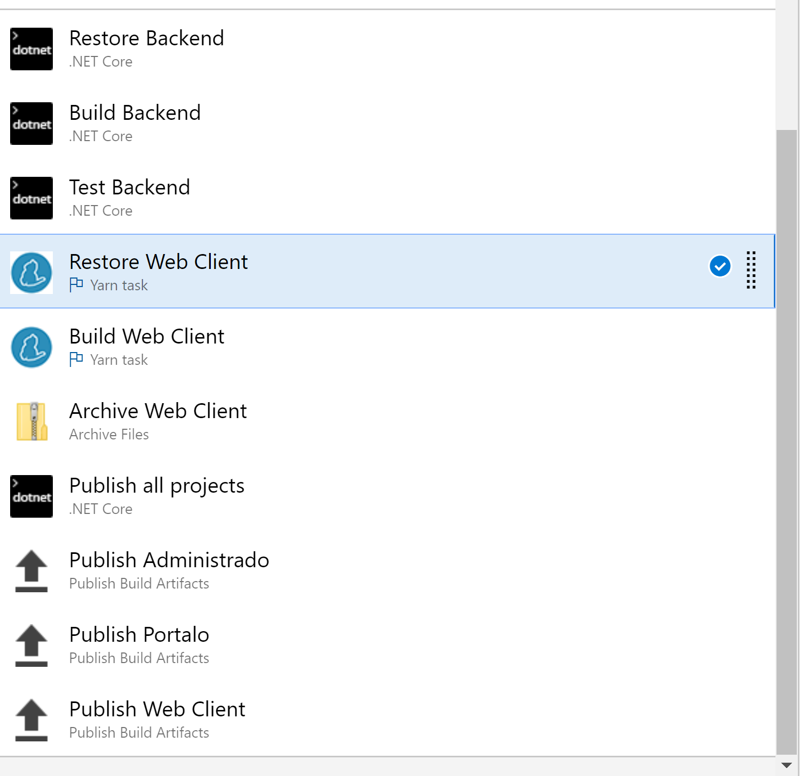
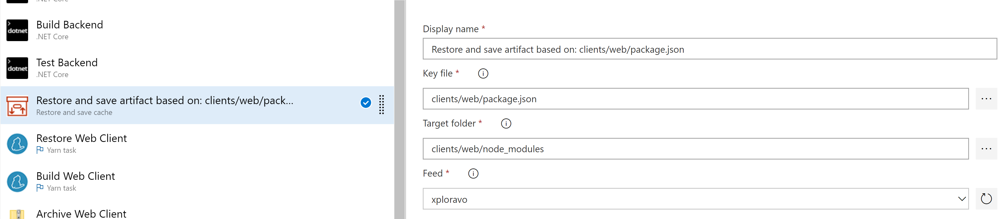
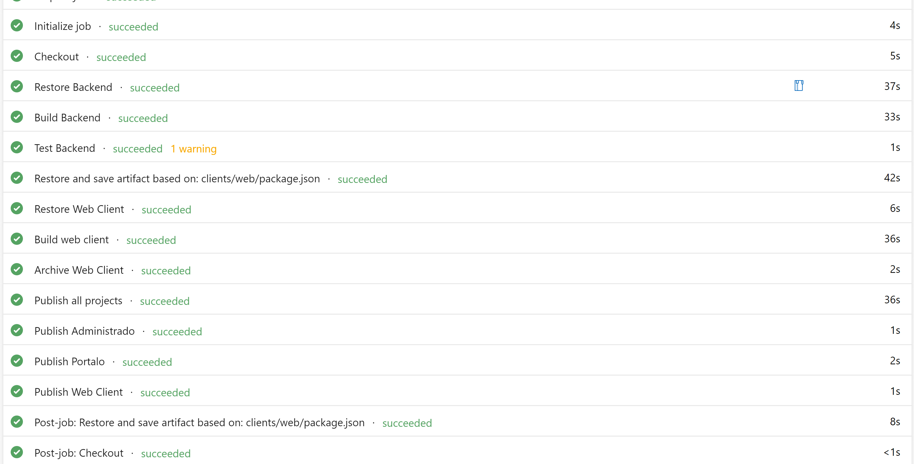

As part of my Azure DevOps pipeline, I've got a step to restore `yarn` dependencies:

If you run your pipeline somewhat regularly then you'll soon come to see this as a bottleneck. Indeed, if you actually take a look at the execution times of each step then you'll notice that this task is responsible for a large part of the work. Given that it is not _that_ common to update your dependencies (relative to other code changes), we should try and shave some time off here.

Luckily for us, Microsoft has already released [a task](https://github.com/microsoft/azure-pipelines-artifact-caching-tasks) that can do exactly this. In order to get it to work we just need to add a single task. Note that you have to put your caching step _before_ the regular restore step.

You'll need an Artifacts feed to publish the cached archives to.

The "Key file" is what the task will use to validate your cache and generate a new entry in case the file changed. We key on `package.json` rather than `yarn.lock` because there can be dependencies that themselves don't depend on other packages -- in which case those builds wouldn't get cached. It does mean we will also invalidate the cache when other changes are made (e.g. the `scripts`) but that is a small price to pay.

The "Target folder" is the actual folder you want to cache, in this case it's our resolved packages.

The first time that you'll now run your pipeline, it will not find a cache entry so execution timing will be as usual. However at the end of the pipeline it will execute a post-job step which takes the data inside `node_modules` and caches it in your artifact repository.

The next time the pipeline runs, your caching step will resolve the caching entry and restore the data. The usual restore step will now notice that the data is already there and skip on happily. There is still some cost involved with reading and writing the packages but it's clearly faster than before. Strangely, the `build` step has also gone down dramatically in cost -- this is unexpected and I'd be happy to learn if anyone has a suggestion why this happened.

Looking at the execution times of my builds, you can see a clear difference between builds that had cached packages and those that had to restore it from scratch.

