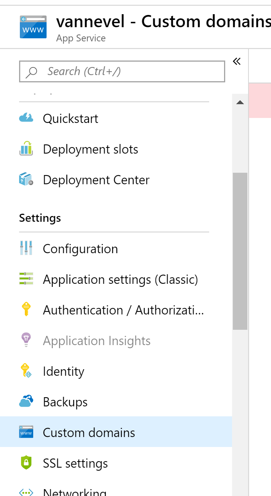
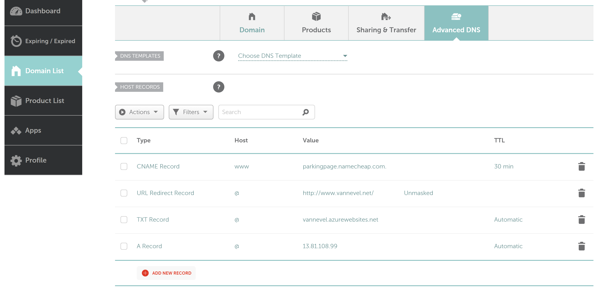
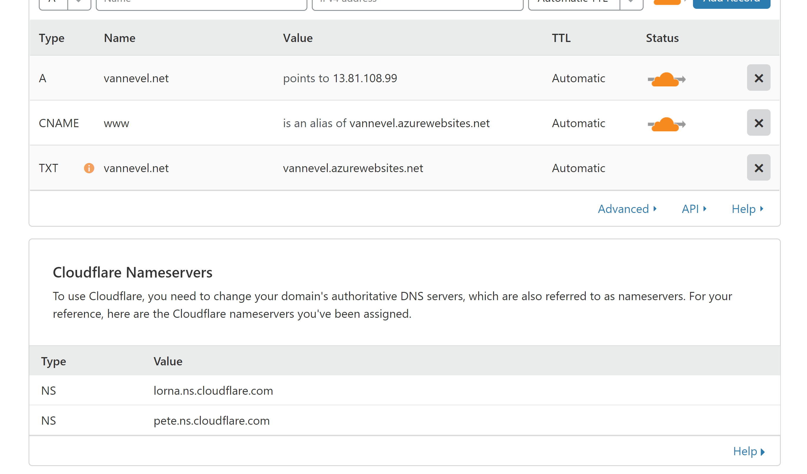
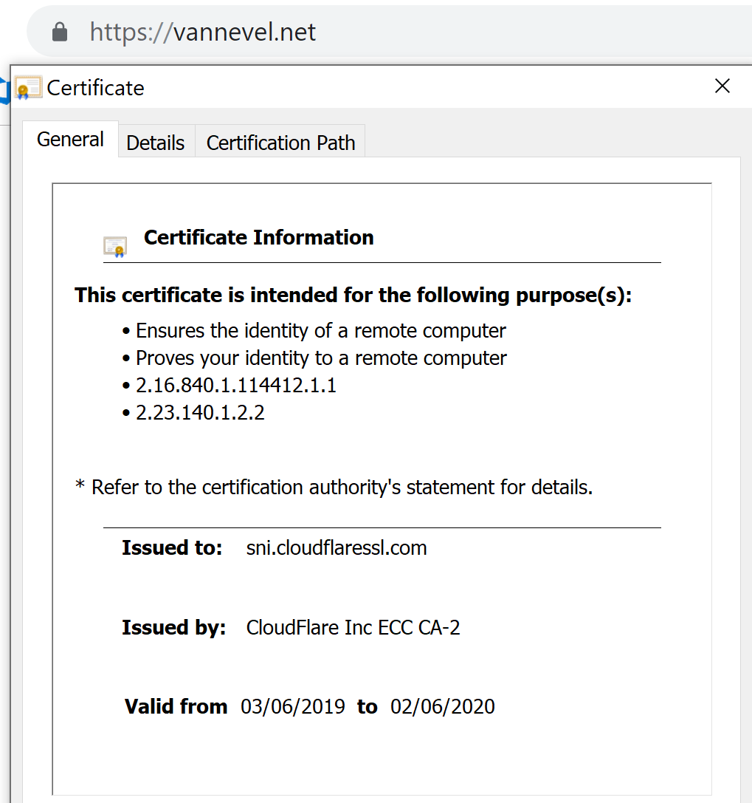

If you've got your own Web App running in Azure, you'll be able to reach it on a domain like https://vannevel.azurewebsites.net.
This is great for testing phases but once you're ready to take it to the next step then you'll want your own domain.

In order to solve this, I am using 3 distinct services:

1. [Namecheap](https://www.namecheap.com/) (domain)
2. [Azure](https://azure.microsoft.com/en-gb/) (hosting)
3. [CloudFlare](https://www.cloudflare.com/) (HTTPS & caching)

While you could ensure HTTPS through many different ways, using Cloudflare is a very painless way of setting it up and it comes with the added benefit of Cloudflare's caches around the world as well as the DDOS protection it brings.
An alternative I would recommend is using [Let's Encrypt](https://www.hanselman.com/blog/SecuringAnAzureAppServiceWebsiteUnderSSLInMinutesWithLetsEncrypt.aspx) though I was turned off by the amount of configuration it required.

## Configure the custom domain
The first thing to do is to add the custom domain to your Web App.

Once in here, add the domain. You will notice it asks you to add a `TXT` and `A` record to your DNS registration. Head over to Namecheap to [add them](https://www.namecheap.com/support/knowledgebase/article.aspx/9846/2208/how-to-point-a-domain-to-azure).

At this point, given some time for the DNS changes to propagate, your site will be available under your custom domain. HTTPS itself won't work though, considering the certificate issued is for `*.azurewebsites.com` and not your own domain.

At this point you sign up for a Cloudflare account. When created you can add a site under the Free plan which contains everything we need. 

Once that is done, it will provide us with two nameservers.

These two nameservers now need to be added as custom DNS to Namecheap:

And you're done! All traffic will now be routed through Cloudflare to your Azure Web App. We can see on our website that HTTPS is enabled and the certificate is valid:

There is one thing to remark: this provides SSL encryption between the client and Cloudflare but things are a bit different between Cloudflare and Azure. Because the domain is different and doesn't match Azure's certificate, it will not validate the issuer. This is the default SSL mode in Cloudflare after setting this up.

Note that DNS changes might take some time to propagate. Depending on what change you are making, it can take between 10 minutes and 24 hours for everything to look okay.