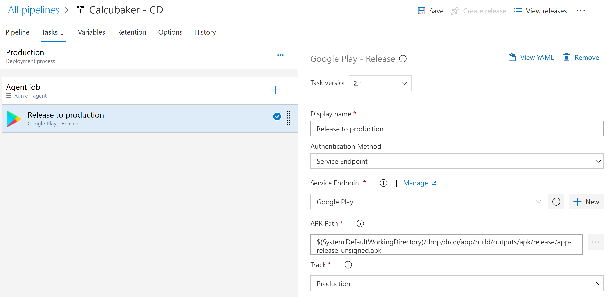
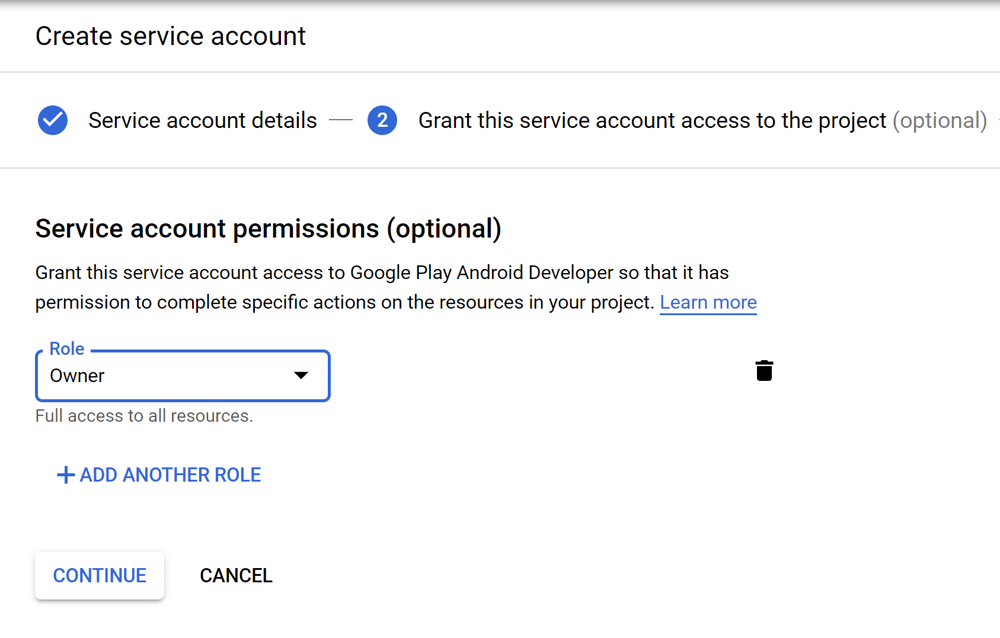
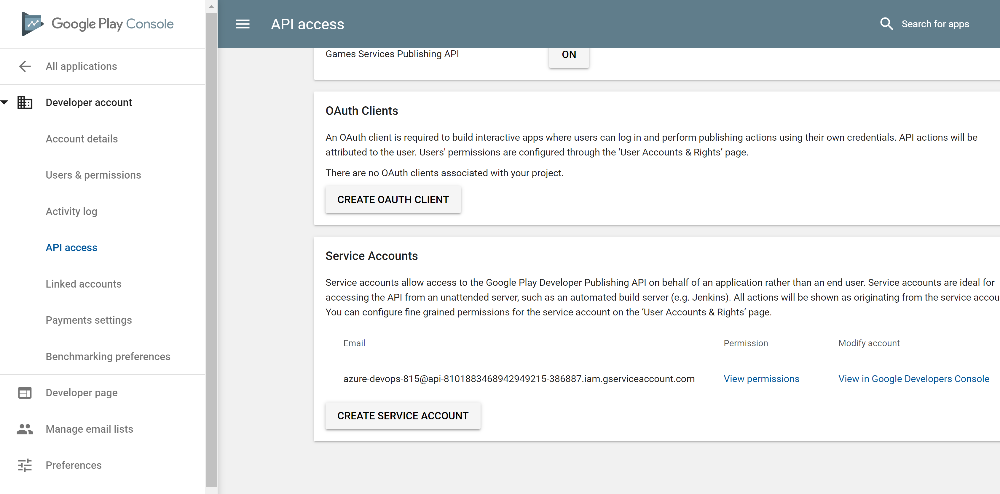

Releasing an Android app manually is cumbersome: you have to build your .apk/app bundle, find your key to sign it with and step through the Google Play console to get it all out the door. Certainly for small apps where you might have a small improvement to make every now and then, it often feels like more effort than you really want to put into it.

In this short walkthrough I'll lay out the general steps on how to setup your Azure DevOps pipeline in such a way that a single commit to the `master` branch will trigger a new App Store release.

I will assume that you already have a working Android app released on the App Store and have the certificate available.

## Summary
We will create a pipeline that executes the gradle task and signs it with our private key. We create a Google Developer service account and link it to our Google Play project. We'll then connect the Google Developer service account to an Azure DevOps service connection. We use that service connection to execute a deploy task to the Google Play store.

## Setting up CI

Go ahead and create a new pipeline based on the Android template. Connect it to your Github repo and changed the generated `azure-pipelines.yml` with the following configuration:

```yml
trigger:
- master

pool:
  vmImage: 'macos-latest'

steps:
- task: Gradle@2
  inputs:
    workingDirectory: ''
    gradleWrapperFile: 'gradlew'
    gradleOptions: '-Xmx3072m'
    publishJUnitResults: false
    testResultsFiles: '**/TEST-*.xml'
    tasks: 'assembleRelease'

- task: DownloadSecureFile@1
  inputs:
    secureFile: 'calcubaker.jks'

- task: AndroidSigning@3
  inputs:
    apkFiles: '**/*.apk'
    apksignerKeystoreFile: 'calcubaker.jks'
    apksignerKeystorePassword: '$(keystorePassword)'
    apksignerKeystoreAlias: '$(keyAlias)'
    apksignerKeyPassword: '$(keyPassword)'
    zipalign: false

- task: CopyFiles@2
  inputs:
    Contents: '**/*.apk'
    TargetFolder: '$(build.artifactStagingDirectory)'

- task: PublishBuildArtifacts@1
  inputs:
    PathtoPublish: '$(Build.ArtifactStagingDirectory)'
    ArtifactName: 'drop'
    publishLocation: 'Container'
```

Couple of things to note here:

* Make sure to specify `assembleRelease` and `assembleDebug` as appropriate (default is `assembleDebug`)
* I uploaded the keystore to the "Secure Files" location. More info on that [here](https://docs.microsoft.com/en-us/azure/devops/pipelines/library/secure-files?view=azure-devops)
* Specify your passwords as secret variables in the pipeline configuration

## Setting up CD

You really only need one task here which really simplifies a lot for us. Make sure you add the [Google Play extension](https://marketplace.visualstudio.com/items?itemName=ms-vsclient.google-play) to your organization. Once you've done that, add the "Google Play Release" task with a similar configuration:



_note: I'm not entirely sure why the release has the `-unsigned` suffix but given that it succesfully releases on the App Store, I assume it's not an issue._

When you [create the service endpoint](https://buddy.works/knowledge/deployments/google-play-private-key-and-permissions) in the Google Developers Console, you _have_ to  give it a role, even though the step is marked as optional. Failure to do so will make it doesn't show up in the Google Play Console (which is where you can connect the service account to your project).



You will now be able to connect your service account to the project.



When you create the service connection inside Azure DevOps, make sure to use the auto-generated email address associated with the Google Service account.

That's it! You now have a fully integrated CI/CD pipeline for your Android apps. I have also provided integration with App Center in my own pipeline just to test out how it works but this is optional. I did search for a Fabric.io task but there isn't any -- this might be important in case you want to integrate with beta testers outside of the Google Play environment. App Center provides a fairly seemless integration with Azure DevOps which makes it easy for packaged Android builds to get picked up and distributed.

The end result is 20 minutes in-between a push to `master` and a notification from the Play store that my update is live, without any action undertaken by me in the meantime.

## References

* [Build, test, and deploy Android apps](https://docs.microsoft.com/en-gb/azure/devops/pipelines/languages/android?view=azure-devops)
* [Setting up a Google Play services account](https://buddy.works/knowledge/deployments/google-play-private-key-and-permissions)
* [Distributing to App Center](https://docs.microsoft.com/en-us/appcenter/distribution/vsts-deploy)

