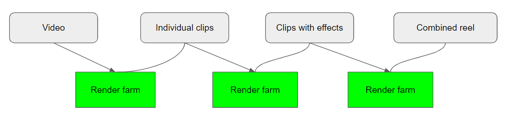

## The background

At [Hudl](https://www.hudl.com/jobs) we do a lot of things with video: coaches upload them, we capture it with our cameras, we enable teams to exchange them, athletes can turn cut them into segments and create a highlight reel, etc. One of the things we do is automatically generate highlight reels to take some of the effort away from athletes: videos that are tagged with metadata (timestamps at which certain actions happen) will go through a system that determines whether an interesting play happened, cut it into smaller clips, adds some effects to it and then concatenate everything into a single 2-3min highlight for that particular athlete.

At one point we noticed that we started to process fewer and fewer of these automatically generated highlights so we dug in. The root cause was quickly found: a large batch of invalid videos were blocking the pipeline. Of course, we asked ourselves why this would have such a large impact in the first place. This is the general process you would follow:



1. A video is ready for processing
2. The video is sent to the render farm, a group of servers that use ffmpeg to handle all sorts of video manipulation
3. The video is cut into a handful of smaller clips
4. The individual clips are then rendered with some effects on top
5. All clips are then rendered again into a single video

Each of these render tasks are inherently asynchronous: there's a dependency on an external process, ffmpeg, which might take a while to complete.
The solution we had in place to go through this multi-render process was to perform a wait-and-retry loop as it checked whether the render result was available yet. This loop had a 30 minute timeout in place, which is what that large batch of invalid videos was hitting: they blocked the thread from processing any videos for 30 minutes each because no render result was ever produced.

This causes a few important issues:

* **Longer execution times** than need be (e.g. when sleeping for 1 minute but the render was finished after 10 seconds)
* Longer execution times also cause **queue build-up** where our processing rate is lower than the inflow rate
* **Timeouts** when longer times are required (e.g. timeout after a few retries but the rendering was still in progress)

This implementation worked fine when it was first introduced as a proof of concept but inevitably it made its way into production and as demand on the system grew, it reached a point where we had to take another look at it. If we were to design this from the bottom up, we'd use an event-based approach and a central state that will kick off new work when it was able to. A quick prototype showed that this would indeed work but given the complexity of the current system, it would require a lot of changes. Due to time constraints and the risk involved with this, we decided that **attempting to retrofit an event-based approach into an interative solution** would incur too much risk.

## The solution
A few years ago I read [this article](http://gigi.nullneuron.net/gigilabs/abstracting-rabbitmq-rpc-with-taskcompletionsource/) by Daniel D'Agostino which outlines how you can use `TaskCompletionSource` to represent the result of a Rabbitmq call. Out of the box, sending an asynchronous message over rabbit would mean the `Task` returns to the caller as soon as the message is _sent_, not when the process it kicks off has finished. The idea here is that we create our own `Task` and we manually signal it as finished as soon as we receive the callback from our rendering farm (which is used to update some data in the database).

This comes with a *massive* benefit: we don't need to change any existing code! All the callers that previously did `await Render(); await Task.Delay();` still work fine, we just need to remove our Delays/Retries. In essence, the code always assumed that the render task would finish in time; we just made it an actual guarantee.

All we needed to do now was create a small orchestrator that keeps track of the tasks we have in progress and set them to the desired result.

```csharp
public class TaskWorker
{
    private readonly ConcurrentDictionary<string, TaskCompletionSource<bool>> _tasks
      = new ConcurrentDictionary<string, TaskCompletionSource<bool>>();

    public Task StartTask(string jobId)
    {
        if (string.IsNullOrWhiteSpace(jobId))
        {
            return Task.CompletedTask;
        }

        var tcs = new TaskCompletionSource<bool>();
        if (_tasks.TryAdd(jobId, tcs))
        {
            return tcs.Task;
        }

        tcs.SetCanceled();
        return Task.CompletedTask;
    }

    public void FinishTask(string jobId)
    {
        if (_tasks.TryRemove(jobId, out var tcs))
        {
            tcs.SetResult(true);
        }
    }
}
```

The above code is a very rough idea of what this could look like. It doesn't do proper error handling in all cases but it demonstrates using a `TaskCompletionSource` to signal the completion of an asynchronous action. Note: There is no non-generic `TaskCompletionSource` which is why we use the placeholder `<bool>` one.

### Issues
An important detail here is that the messaging system we use to communicate between the render farm and the highlight server works in a round-robin format. This works fine on your local machine where there is only one node but once it goes into production, there's a high chance that the message intended to signal render completion for a task on server A will instead end up at any of 10 other servers. This would result in an endlessly hanging `Task` until it reaches our timeout mechanism.

We couldn't change the messaging system to use a fanout principle so instead we decided to use another orchestrator to ensure messages are distributed. By using [Redis subscriptions](https://redis.io/topics/pubsub) we can very performantly publish a single message and have it read by all consumers.
Put into practice, we created a publisher & subscriber for all our servers on the same channel and wrote the unique render job ID to it. Whichever server actually held that ID in its memory, would then mark it as done and let the thread continue.

In code this is as straightforward as

```csharp
public class TaskWorker
{
    public TaskWorker()
    {
      _subscriber = _connection.GetSubscriber();
      _publisher = _connection.GetSubscriber();
      _subscriber.Subscribe(ChannelName, OnMessageReceived);
    }

    public async Task FinishRenderJob(string jobId)
    {
        await _subscriptionManager.Publish(jobId);
    }

    internal void OnMessageReceived(string message)
    {
        if (_tasks.TryRemove(message, out var tcs))
        {
            tcs.SetResult(true);
        }
    }
}
```

## Conclusion

Like anything, this approach comes with a few disadvantages as well: in-progress render jobs have their info stored in memory, long running tasks means holding up threads, etc. In our particular scenario these were all valid trade-offs: we can always restart the process if we want to and the results it produces are not considered vital. We also restrict ourselves to only use a handful of threads per server to handle this work in the first place, a limit we could also increase to sort out immediate problems.
Similarly we could've also used more primitive constructs like semaphores to signal the asynchronous completion but there is a certain beauty to changing the semantics of a language construct to actually do what you intend it to mean.

The graphs don't lie: while we still encounter issues from different sources, overall the process has become a lot more predictable.


In the end, we've come up with a solution that required minimal code changes and brought stability to the rendering process.

