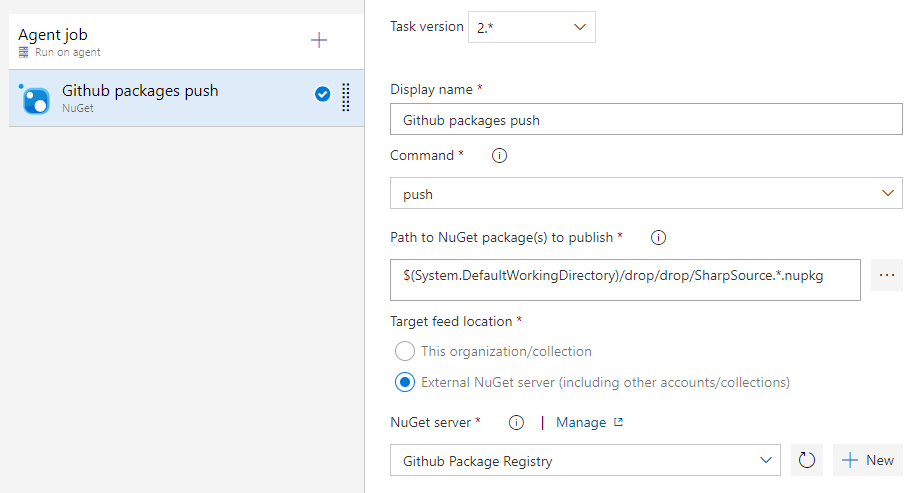
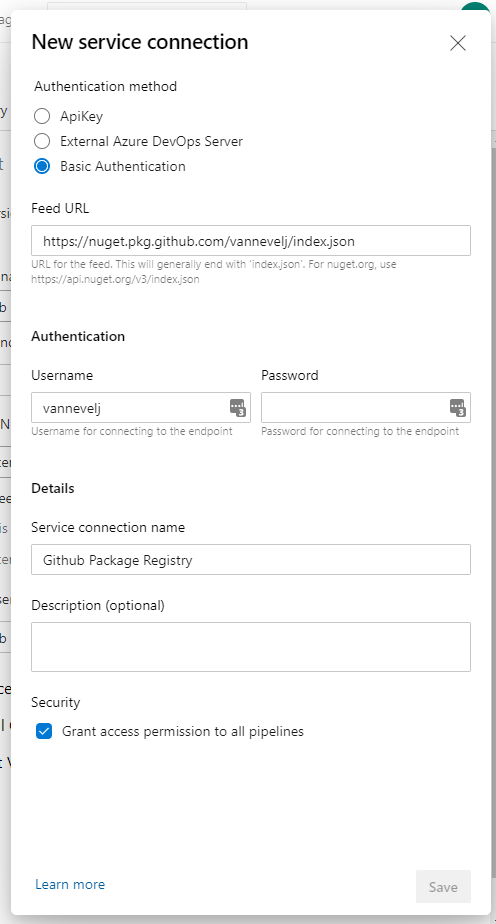
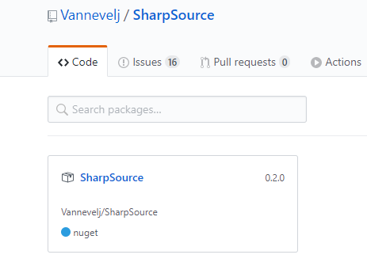

With the release of [Github's own package registry](https://github.com/features/packages) there's now yet another place for developers to source their dependencies. Luckily, integrating this with your existing Azure DevOps workflow is trivially done in just a few steps.

## Add the task

The general setup is the same as any other NuGet step: add a `Nuget` task using the `push` command and point it to the nupkg file that your build process generated.

## Configure the service connection

We then create a new service connection for the Github package registry. Reading [the Github docs](https://help.github.com/en/packages/using-github-packages-with-your-projects-ecosystem/configuring-dotnet-cli-for-use-with-github-packages), it appears that only username+password is supported so select `Basic Authentication`.

The Feed URL is in the form of https://nuget.pkg.github.com/OWNER/index.json where `OWNER` should be replaced with the user or organization that you're deploying to (all lowercase!). In my case this becomes https://nuget.pkg.github.com/vannevelj/index.json.

Rather than using your actual password, generate a Personal Access Token [on your Github account](https://github.com/settings/tokens) that has `read:packages`, `write:packages` and `delete:packages` permissions.

## Configure the nuget package

At this point the only thing left to do is ensure that our .nuspec file is up to scratch. Most importantly, ensure that the `repository` property is set as Github uses it to verify the package matches the user/org you're trying to add it to. When using a .nuspec file, add an entry along the lines of `<repository type="git" url="https://github.com/vannevelj/sharpsource'>`.
If you instead use csproj properties, the equivalent is `<RepositoryUrl>https://github.com/vannevelj/sharpsource</RepositoryUrl>`

The end result speaks for itself:

