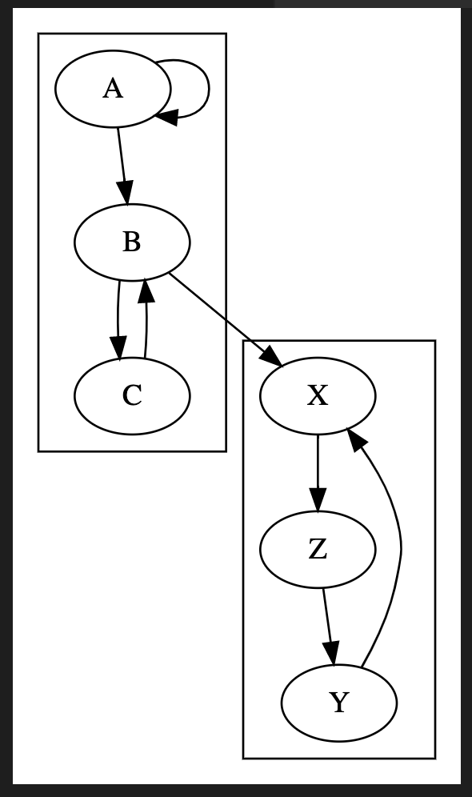
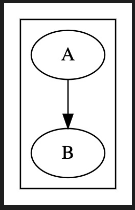
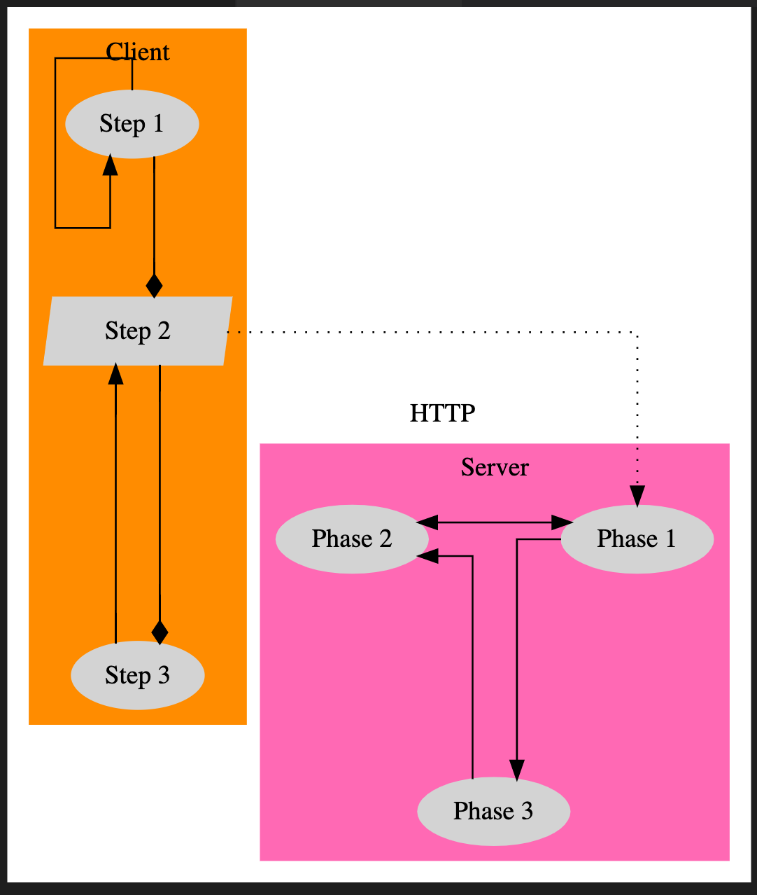

I've often found myself thinking about how useful it would be to create a diagram of some architecture but more often than not, the thought of having to go in Google Drawings and mess around with arrows and circles stops me in my tracks. Whenever I do go for it, I spend most of my time on laying it all out. Updating a previously created diagram is a plain no-go.

For a project I wanted to dig deeper into some existing architecture and quickly found myself overwhelmed -- a flow diagram was inevitable. While I initially hoped to automatically generate one, that proved to be impossible. Throughout all this I did come across [DOT](https://en.wikipedia.org/wiki/DOT_(graph_description_language)) -- a _graph description language_ which allows you to define nodes and edges and takes care of all the visual aspects. 

## Getting started

It's quite straightforward to get started:

* Install [GraphViz](https://graphviz.org/download/), which includes DOT
* Install the [GraphViz VS Code extension](https://marketplace.visualstudio.com/items?itemName=joaompinto.vscode-graphviz)

With this in place, you can create a new `.gv` file in VS Code and use `Cmd` + `K` + `V` to open the preview window and every change you make will immediately be rendered to the side.

## Your first diagram

The DSL it uses is very straightforward: define the graph type (directed or not), define nodes and how they are related.
A very basic example could look like this:

```
digraph {
    A -> B
}
```

which brings us to this basic graph:


## Your second diagram

With the simplest of definitions we've been able to connect two nodes but the real work still has to start. Our system will be more complex and consist out of larger subsystems, each of which we might want to model. Take a look at this example:

```
digraph {
    subgraph cluster_client {
        A
        B
        C
    } 
    
    subgraph cluster_server {
        X
        Y
        Z
    }

    A -> B -> C
    C -> B
    A -> A

    X -> Z -> Y
    Y -> X

    B -> X
}
```



There are a couple of things at play here:

* We've introduced the concept of a `subgraph` which allows us to provide a logical grouping for subsystems
* By prefixing the graph name with `cluster_`, it will render it with a bounding rectangle

It's important to note that I've opted to split out declaring the node and edges from eachother. If we were to omit the node declaration and have it inferred from the edge declaration, the node would be included in the subgraph the edge is defined in which is not always what's intended. The below example can make this clear:

```
digraph {
    subgraph cluster_client {
        A
    } 
    
    subgraph cluster_server {
        B
    }

    A -> B
}
```

will produce


However if we were to define the edge connection in-place then the rendering shows no separate subgraphs: `B` is considered to be in the same cluster as `A`.

```
digraph {
    subgraph cluster_client {
        A -> B
    } 
    
    subgraph cluster_server {
        B
    }
}
```



Particularly when you're constantly revisiting your idea of what the architecture looks like, I find it much easier to define all nodes first and draw the edges at the end: it will avoid a node being unintentionally considered part of a different cluster.

### Your third diagram

Now that we are able to draw diagrams of any complexity, we'll start to think a little bit more about how we can customize it. There are [many different aspects](https://www.graphviz.org/doc/info/attrs.html) we can change but some that come to mind:

* Change node names
* Add labels to edges
* Change arrow styles
* Add background colours

The documentation can provide all the info you need but as an example that applies this, here's our example slightly reworked:

```
digraph {
    node [style=filled, color=lightgrey]
    style=filled
    splines=ortho

    subgraph cluster_client {
        label = "Client"
        color = "darkorange"

        A [label = "Step 1"]
        B [label = "Step 2" shape = "polygon" skew="0.1"]
        C [label = "Step 3"]
    } 
    
    subgraph cluster_server {
        label = "Server"
        color = "hotpink"
        {rank = same; X; Y}
        
        X [label = "Phase 1"]
        Y [label = "Phase 2"]
        Z [label = "Phase 3"]
    }

    A -> B -> C [arrowhead = "diamond"]
    C -> B
    A -> A

    X -> Z -> Y
    Y -> X [dir = "both"]

    B -> X [label = "HTTP" style = "dotted"]
}
```

