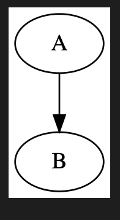

I've often found myself thinking about how useful it would be to create a diagram of some architecture but more often than not, the thought of having to go in Google Drawings and mess around with arrows and circles stops me in my tracks. Whenever I do go for it, I spend most of my time on laying it all out. Updating a previously created diagram is a plain no-go.

For a project I wanted to dig deeper into some existing architecture and quickly found myself overwhelmed -- a flow diagram was inevitable. While I initially hoped to automatically generate one, that proved to be impossible. Throughout all this I did come across [DOT](https://en.wikipedia.org/wiki/DOT_(graph_description_language)) -- a _graph description language_ which allows you to define nodes and edges and takes care of all the visual aspects. 

## Getting started

It's quite straightforward to get started:

* Install [GraphViz](https://graphviz.org/download/), which includes DOT
* Install the [GraphViz VS Code extension](https://marketplace.visualstudio.com/items?itemName=joaompinto.vscode-graphviz)

With this in place, you can create a new `.gv` file in VS Code and use `Cmd` + `K` + `V` to open the preview window and every change you make will immediately be rendered to the side.

## Your first diagram

The DSL it uses is very straightforward: define the graph type (directed or not), define nodes and how they are related.
A very basic example could look like this:

```
digraph {
    A -> B
}
```

which brings us to this basic graph:

