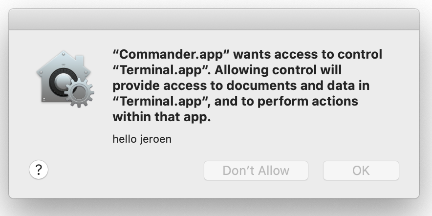

I've been working on a little MacOS app which is supposed to spawn a Terminal and execute commands in it. As I was digging through `Process` and `NSTask` I wasn't able to find a way to do both of these actions. However through some embedded AppleScript, you _can_ get it to work.

The below code will achieve exactly that:

```swift
func execute(command: String) {
    let script = """
tell application \"Terminal\"
    do script "\(command)"
end tell
"""
    var error: NSDictionary?
    if let scriptObject = NSAppleScript(source: script) {
        let output = scriptObject.executeAndReturnError(&error)
        
        if (error != nil) {
            print("error: \(String(describing: error))")
        } else {
            print("output: \(String(describing: output.stringValue))")
        }
    }
}
````

If you now execute this, you'll see an error similar to this in your console:

```
error: Optional({
    NSAppleScriptErrorAppName = Terminal;
    NSAppleScriptErrorBriefMessage = "Not authorized to send Apple events to Terminal.";
    NSAppleScriptErrorMessage = "Not authorized to send Apple events to Terminal.";
    NSAppleScriptErrorNumber = "-1743";
    NSAppleScriptErrorRange = "NSRange: {26, 55}";
})
```

In order to grant these permissions, add the following to your info.plist:

```xml
<key>NSAppleEventsUsageDescription</key>
<string>hello jeroen</string>
```

If you now trigger this behaviour again, you'll be prompted with the following popup:

