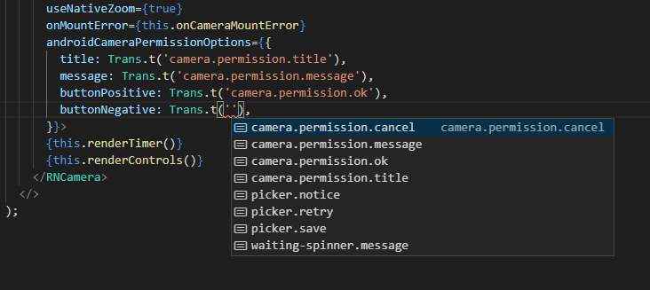

I built [a small Android app](https://play.google.com/store/apps/details?id=com.zenzizenzi.camhelp) for my grandad the other day. It contained a bit of text in the UI so naturally I wrote it in English. Once I got around to releasing it, I decided it would be nicer for him if he could read it in his native language. A quick look around showed some i18n libraries which would do the trick but they all felt rather heavy-handed.
We're talking a very small app with just a few strings and nothing fancy like allowing the user to change. Surely I can write something quick that sorts this out?

And I did! The below code is all that's needed to pick the default language and fall back to English if no translation is found for a given key:

```typescript
import translations from './translations.json';
import * as RNLocalize from 'react-native-localize';

type TranslationKeys = keyof typeof translations;

export default class TextHelper {
  private static locale: string = 'en';

  public static init = () => {
    const locales = RNLocalize.getLocales();
    TextHelper.locale = locales[0]?.languageCode ?? 'en';
  };

  public static t = (key: TranslationKeys) => {
    const text = translations[key];

    const preferredLanguage = (text as any)[TextHelper.locale];
    return preferredLanguage ?? text.en;
  };
}
```

All that's needed is a call to `TextHelper.init()` in your `index.js` to load the current locale and you're set. Of course, you'll also need `react-native-localize` as a dependency.

In the same folder I then have a simple json file with translations:

```
{
    "camera.permission.title": {
        "en": "Permission to use camera",
        "nl": "Camera gebruik toelaten"
    },
    "camera.permission.message": {
        "en": "We need your permission to use your camera.",
        "nl": "We hebben uw toestemming nodig om de camera te gebruiken."
    },
}
```

Note how I've opted to group the translations by key rather than language. This can present trade-offs (it might be easier to perform automatic translations if they're grouped by language) but right now it makes it straightforward to spot if any keys are missing a translation so I've gone with that.

An additional benefit is that I can use Typescript to provide intellisense suggestions:



Note that you need to have `resolveJsonModule` enabled in your .tsconfig to import .json files like this.