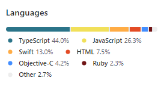
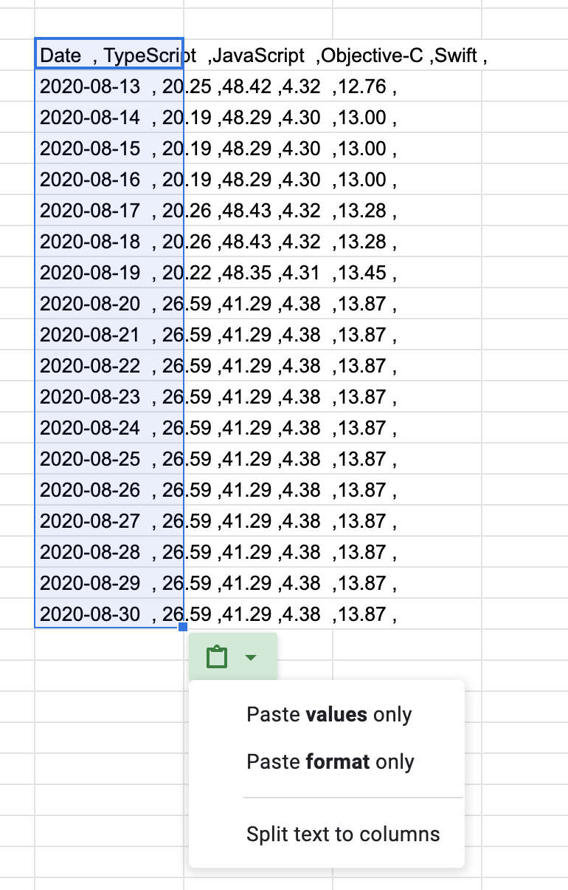
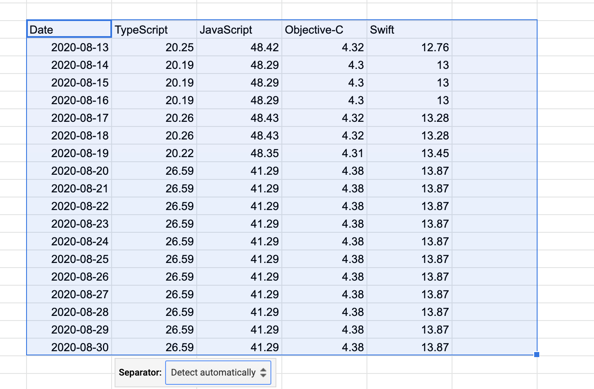
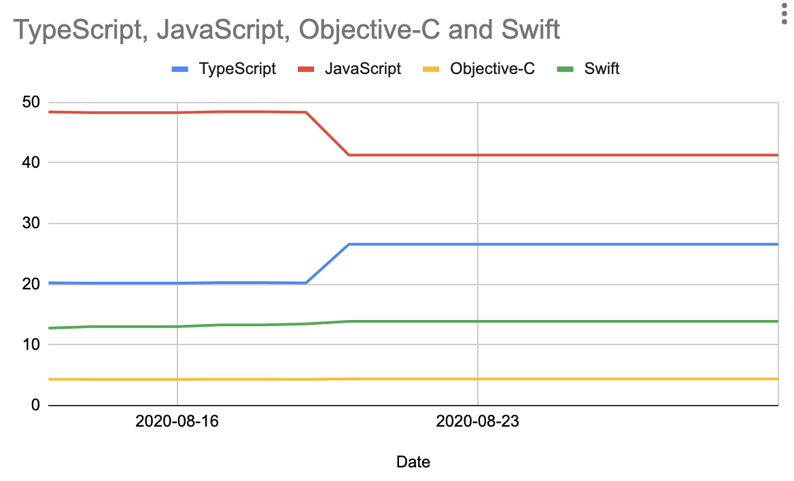
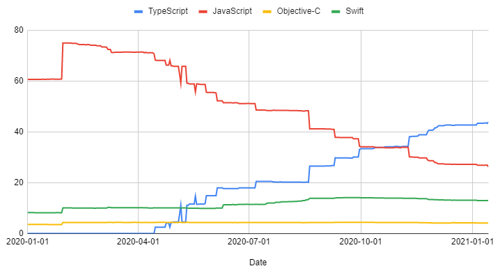

If you've ever gone through the trouble of incrementally migrating a codebase from one language to another then you know this is not something that gets done in a few weeks. You can mark all the milestones you want but in the end nothing beats a nice graph that shows continuous improvements to your stakeholders.

Github has this very useful feature where it shows the language distribution of your repo at that point in time. What we want is this, but then for each day -- and ideally, we won't be taking notes manually every time.



So I've done exactly that with the following bash script:

```bash
#!/usr/local/bin/bash
repo=~/Documents/source/my-repo
branch="master"
startdate=2019-05-01
enddate=2021-01-15
declare -A langs=(["JavaScript"]=0 ["TypeScript"]=0)

for key in "${!langs[@]}"; do pattern+='%-15s,'; done
cd $repo
regex="([0-9]+\.[0-9]+)%[[:space:]]*([A-Za-z#-]*)"
printf '%-15s, %s' "Date"
printf "$pattern %s\n" "${!langs[@]}"

while [ "$startdate" != $enddate ]; do
    git checkout `git rev-list -1 --before "$startdate" "$branch"` > /dev/null 2>&1
    table="$(github-linguist)"
    printf '%-15s, %s' "$startdate"

    while [[ $table =~ $regex ]]; do
        for lang in "${!langs[@]}"
        do
            if [ "$lang" == "${BASH_REMATCH[2]}" ]; then
                langs[$lang]="${BASH_REMATCH[1]}"
            fi
        done
        table=${table##*${BASH_REMATCH[1]}}
    done

    printf "$pattern %s\n" "${langs[@]}"
    startdate=$(date -j -v +1d -f "%Y-%m-%d" $startdate +%Y-%m-%d)
    for key in "${!langs[@]}"; do langs[$key]=0; done
done
```

First, some prerequisites:
* Follow the install instructions for github-linguist [here](https://github.com/github/linguist). If you use a recent MacOS version like me then you're likely to bump into some issues getting it running. I've documented them [here](https://github.com/github/linguist/issues/5147#issuecomment-761017609).
* I ran `sudo gem pristine curb --version 0.9.10` to remove some unwanted console output
* You'll need Bash 4 to support hash tables so run `brew install bash` to get the latest version

Some tricky aspects worth calling out: 
* Bash regex is a different dialect than most people I'd wager are used to. `\d` does not exist and needs to be replaced with `[0-9]` instead. Similarly, `[[:space:]]` is roughly equivalent to `\s`.
* While we're talking about regex, iterating through the regex matches is an absolute pain. I still don't fully understand what `table=${table##*${BASH_REMATCH[1]}}` does but it works so I'm not touching it (credit to [this gist](https://gist.github.com/PandaEox/5215e33dca9c14076eff)).
* To get the values from a hash table, you use `${langs[@]}`. To get the keys, you use `${!langs[@]}`

The overarching idea behind this is straightforward:

1. Check out the code at a given date
2. Run github-linguist to determine the language distribution
3. Parse the output and re-output it in a format that is better for us
4. Go to the next day and return to step 2

This will give you an output like this:

```
Date           , TypeScript     ,JavaScript     ,Objective-C    ,Swift          , 
2020-08-13     , 20.25          ,48.42          ,4.32           ,12.76          , 
2020-08-14     , 20.19          ,48.29          ,4.30           ,13.00          , 
2020-08-15     , 20.19          ,48.29          ,4.30           ,13.00          , 
2020-08-16     , 20.19          ,48.29          ,4.30           ,13.00          , 
2020-08-17     , 20.26          ,48.43          ,4.32           ,13.28          , 
2020-08-18     , 20.26          ,48.43          ,4.32           ,13.28          , 
2020-08-19     , 20.22          ,48.35          ,4.31           ,13.45          , 
2020-08-20     , 26.59          ,41.29          ,4.38           ,13.87          , 
2020-08-21     , 26.59          ,41.29          ,4.38           ,13.87          , 
2020-08-22     , 26.59          ,41.29          ,4.38           ,13.87          , 
2020-08-23     , 26.59          ,41.29          ,4.38           ,13.87          , 
2020-08-24     , 26.59          ,41.29          ,4.38           ,13.87          , 
2020-08-25     , 26.59          ,41.29          ,4.38           ,13.87          , 
2020-08-26     , 26.59          ,41.29          ,4.38           ,13.87          , 
2020-08-27     , 26.59          ,41.29          ,4.38           ,13.87          , 
2020-08-28     , 26.59          ,41.29          ,4.38           ,13.87          , 
2020-08-29     , 26.59          ,41.29          ,4.38           ,13.87          , 
2020-08-30     , 26.59          ,41.29          ,4.38           ,13.87          , 
```

The commas make it look a little bit off but they exist for a reason: now we use the power of [Google Sheets](https://support.google.com/a/users/answer/9308645?hl=en). Using this format, we can simply copy-paste our console output into a sheet. 



When doing so, Google Sheets will suggest to split it into columns and produce a nicely separated table:



Creating a chart is now trivial and gives you something like this:



Of course this is only looking at a very short period of time. The longer the timespan, the more useful your charts will be, e.g.

