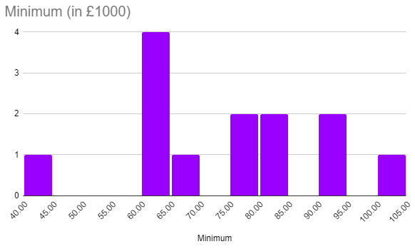
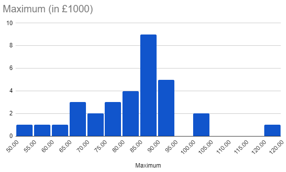
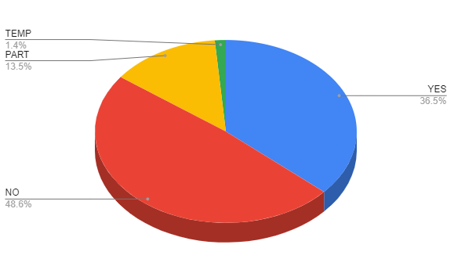

I wanted to get a sense of the market out there so I changed my LinkedIn status to "Open to work". Initially I had the intention to chat to a few recruiters but it became quickly evident that I had invited a deluge of messages that overwhelmed me. To regain some control and oversight, I've tried to categorise the data that came in. In this post I'll provide a brief overview of these results to share the knowledge. I will note that this is intentionally a low-fidelity approach at evaluating the market so you should expect variation. It might, however, be a reasonable indicator of where the talent market is at this time.

For context, my own background can be found [here](https://www.linkedin.com/in/vannevelj/). No big name companies, working in London with 5 years experience of which 2 years as senior engineer. Stack ranges from back-end C# services to React Native front-ends.

I evaluated this under the following constraints:
* Messages were received between May 20 and June 4, a period of **15 days**.
* **74** messages were considered in this analysis
* The data is gathered from the initial message, I did not respond to ask for more info
* I only looked at messages that were about a specific position, general introductions were not counted
* Everything is evaluated pessimistically: if no remote work is mentioned, it's a NO. If it says "salary £80k" then that's considered the maximum
* Remote work is considered a "YES" if it would allow you to live anywhere in the UK. "2days/month" in London is considered "YES". "2 days/week in the office" is considered "PART".

Due to the big difference in messages that mention both min & max salary, I'll provide their data separately.

---

## Minimum Salary
|       |  |
| ----------- | ----------- |
| N      | **13**      |
| Average   | **£71,923.08**        |
| Median   | **£75,000.00**        |
| 75th pct   | **£80,000.00**        |

## Maximum Salary
|       |  |
| ----------- | ----------- |
| N      | **32**       |
| Average   | **£80,625.00**        |
| Median   | **£85,000.00**        |
| 75th pct   | **£86,250.00**        |

## Remote work

It's worth re-iterating that for many of these "NO" responses it was first and foremost a case of not knowing the answer at all.

|       |  |
| ----------- | ----------- |
| Total      | **74**       |
| Yes   | **27**        |
| No   | **36**        |
| Partly   | **10**        |
| Temporarily   | **1**        |

