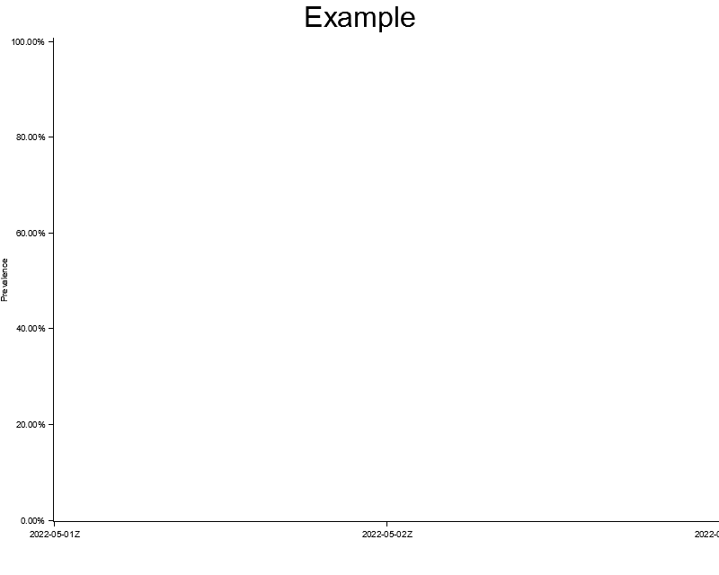
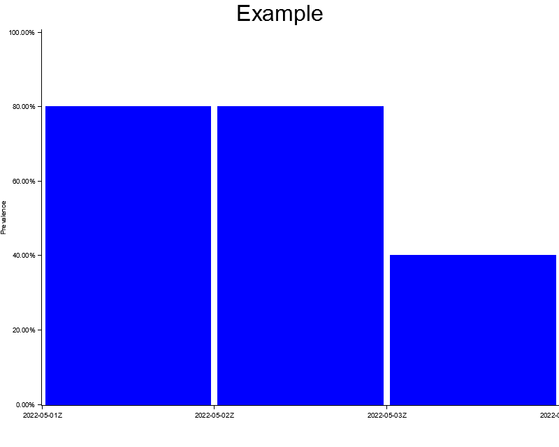
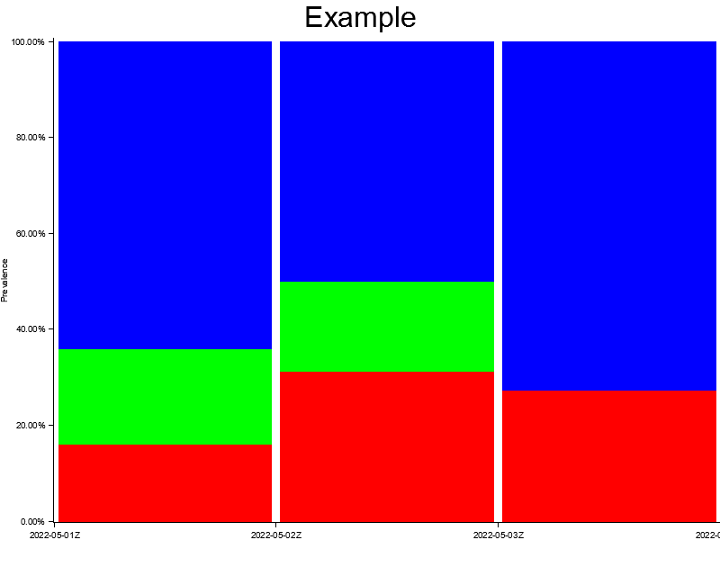

A while ago I wrote a post on how I generated [a visualization of the language migration in a codebase](https://vannevel.net/posts/visualizing-the-language-migration-of-a-codebase). As time passed I referred back to it on several occassions but it quickly started to frustrate me: the poor dependency management experience required a bunch of manual setup steps which I don't want to do every time I setup a new laptop. On top of that, the dependencies themselves sometimes broke because something else on the system changed (see my note at the bottom) and I've always felt a bit uneasy that there's a manual step involved to actually create the graph.

As I am diving into Rust, this felt like a great opportunity to get rid of some dependencies and get it all contained in a single binary. This brings me to [lingo-rs](https://github.com/Vannevelj/lingo-rs): a self-contained Rust application available on Windows, Mac & Linux which will generate a graph of a repo's language distribution over time.

It consists of three main aspects:
* [Repository handling behaviour](https://github.com/Vannevelj/lingo-rs/blob/6b3c2574722bb29f4368e6ad3925069ac789e6af/src/main.rs), such as checking out the branch on different dates
* [Content analysis](https://github.com/Vannevelj/lingo-rs/blob/6b3c2574722bb29f4368e6ad3925069ac789e6af/src/main.rs#L141-L191), to figure out which files belong to what language and which can be ignored
* [Graph generation](https://github.com/Vannevelj/lingo-rs/blob/6b3c2574722bb29f4368e6ad3925069ac789e6af/src/graph.rs), to display the results in an intuitive manner

# Creating a stacked bar chart

[Plotters](https://github.com/plotters-rs/plotters) is a powerful library to create data visualizations and provides a lot of functionality in the form of straightforward helper functions. One thing that is less obvious though is how to create a stacked chart (i.e. values are normalized between 0% and 100%).

In this example we'll walk through the steps on how to create your own chart with stacked values.
Let's start by creating our repo and adding a few dependencies:

```sh
cargo new plotters-example
cd plotters-example
```

**cargo.toml**
```toml
[package]
name = "plotters-example"
version = "0.1.0"
edition = "2021"

[dependencies]
chrono = "0.4.19"
plotters = "0.3.1"
```

Let's start by creating a bit of test data:

```rs
use chrono::NaiveDate;
use plotters::style::RGBColor;

struct Entry {
    date: NaiveDate,
    value: f64,
}
struct Summary(String, RGBColor, Vec<Entry>);

fn create_date(date: &str) -> NaiveDate {
    NaiveDate::parse_from_str(date, "%Y-%m-%d").unwrap()
}

fn create_summary() -> Vec<Summary> {
    vec![
        Summary(
            String::from("Option 1"),
            RGBColor(255, 0, 0),
            vec![
                Entry { date: create_date("2022-05-01"), value: 20.0 },
                Entry { date: create_date("2022-05-02"), value: 50.0 },
                Entry { date: create_date("2022-05-03"), value: 15.0 },
            ],
        ),
        Summary(
            String::from("Option 2"),
            RGBColor(0, 255, 0),
            vec![
                Entry { date: create_date("2022-05-01"), value: 25.0 },
                Entry { date: create_date("2022-05-02"), value: 30.0 },
                Entry { date: create_date("2022-05-03"), value: 0.0 },
            ],
        ),
        Summary(
            String::from("Option 3"),
            RGBColor(0, 0, 255),
            vec![
                Entry { date: create_date("2022-05-01"), value: 80.0 },
                Entry { date: create_date("2022-05-02"), value: 80.0 },
                Entry { date: create_date("2022-05-03"), value: 40.0 },
            ],
        ),
    ]
}

fn main() {
    let data_for_graph = create_summary();
}
```

This will give us a few days worth of data, grouped in three series with a hardcoded color each. Our next step is to provide plotters-rs with an output file and some basic chart setup:

```rs
let root = BitMapBackend::new("output.png", (800, 640)).into_drawing_area();
root.fill(&WHITE).expect("Failed to set chart background");

let mut chart = ChartBuilder::on(&root)
  .caption("Example", ("sans-serif", 40).into_font())
  .set_label_area_size(LabelAreaPosition::Left, 60)
  .set_label_area_size(LabelAreaPosition::Bottom, 60)
  .build_cartesian_2d(
      Utc.from_utc_date(&create_date("2022-05-01"))..Utc.from_utc_date(&create_date("2022-05-04")),
      -0.00001..101.0,
  )
  .expect("Failed to set chart axis");

chart
  .configure_mesh()
  .disable_x_mesh()
  .disable_y_mesh()
  .y_label_formatter(&|x| format!("{:.2}%", x))
  .y_desc("Prevalence")
  .draw()
  .expect("Failed to render mesh");
```

We define our 2D plane with dates on the X-axis. The Y-axis we use a little bit of trickery to ensure that plotters-rs always starts at 0 and displays the 100 label.

At this point we can run our code and we see it generated an empty chart with Y-labels for 0 and 100:



The next step is to draw some series through the `chart.draw_series()` API:

```rs
for summary in data_for_graph.iter() {
  let color = summary.1;

  chart
      .draw_series(summary.2.iter().map(|entry| {
          let x0 = Utc.from_utc_date(&entry.date);
          let x1 = Utc.from_utc_date(&entry.date.add(Duration::days(1)));

          let mut bar = Rectangle::new([(x0, 0.0), (x1, entry.value)], color.filled());
          bar.set_margin(0, 0, 5, 5);
          bar
      }))
      .expect("Failed to draw series")
      .legend(move |(x, y)| {
          PathElement::new(vec![(x, y), (x + 20, y)], color.stroke_width(3))
      })
      .label(&summary.0);
}
```

For each series we draw the entry. The entry is drawn for a particular date (i.e. the horizontal axis) and we return a `Rectangle` with the height of our value.

However if we now print this out, we can see that only the blue graph is displayed:



This happens because all three charts are rendered right on top of each other starting at Y-value `0`. Blue is our last series to draw so it ends up layered above the others.

The solution here is to calculate the cumulative percentage of each series for a given day and then use that to offset the series we render. There are a lot of ways to calculate this but for brevity purposes I've included a very crude way of doing so. In a production scenario with more data you should take a less wasteful approach.

```rs
let mut entries_for_day: Vec<&Entry> = data_for_graph
    .iter()
    .flat_map(|m| &m.2)
    .filter(|f| f.0 == entry.0)
    .collect();
entries_for_day.sort_by(|a, b| a.0.cmp(&b.0));
let absolute_start: f64 = entries_for_day[0..index].iter().map(|m| m.1).sum();
let total: f64 = entries_for_day.iter().map(|m| m.1).sum();

let relative_start = absolute_start / total * 100.0;
let relative_length = entry.1 / total * 100.0;

let mut bar = Rectangle::new(
    [(x0, relative_start), (x1, relative_start + relative_length)],
    color.filled(),
);
```

For each entry we will now calculate all the other entries for that same day. Based on this total, an index and a deterministic ordering of the elements, we can now calculate a vertical axis offset to avoid overlapping.

And that's it! If you now add the `#[derive(Clone)]` directives and run your code, you will generate the following image:



For completeness' sake, this is the full code:

```rs
use std::ops::Add;

use chrono::{Duration, NaiveDate, TimeZone, Utc};
use plotters::{
    prelude::{
        BitMapBackend, ChartBuilder, IntoDrawingArea, LabelAreaPosition, PathElement, Rectangle,
    },
    style::{Color, IntoFont, RGBColor, WHITE},
};

#[derive(Clone)]
struct Entry {
    date: NaiveDate,
    value: f64,
}
#[derive(Clone)]
struct Summary(String, RGBColor, Vec<Entry>);

fn create_date(date: &str) -> NaiveDate {
    NaiveDate::parse_from_str(date, "%Y-%m-%d").unwrap()
}

fn create_summary() -> Vec<Summary> {
    vec![
        Summary(
            String::from("Option 1"),
            RGBColor(255, 0, 0),
            vec![
                Entry { date: create_date("2022-05-01"), value: 20.0 },
                Entry { date: create_date("2022-05-02"), value: 50.0 },
                Entry { date: create_date("2022-05-03"), value: 15.0 },
            ],
        ),
        Summary(
            String::from("Option 2"),
            RGBColor(0, 255, 0),
            vec![
                Entry { date: create_date("2022-05-01"), value: 25.0 },
                Entry { date: create_date("2022-05-02"), value: 30.0 },
                Entry { date: create_date("2022-05-03"), value: 0.0 },
            ],
        ),
        Summary(
            String::from("Option 3"),
            RGBColor(0, 0, 255),
            vec![
                Entry { date: create_date("2022-05-01"), value: 80.0 },
                Entry { date: create_date("2022-05-02"), value: 80.0 },
                Entry { date: create_date("2022-05-03"), value: 40.0 },
            ],
        ),
    ]
}

fn main() {
    let data_for_graph = create_summary();

    let root = BitMapBackend::new("output.png", (800, 640)).into_drawing_area();
    root.fill(&WHITE).expect("Failed to set chart background");

    let mut chart = ChartBuilder::on(&root)
        .caption("Example", ("sans-serif", 40).into_font())
        .set_label_area_size(LabelAreaPosition::Left, 60)
        .set_label_area_size(LabelAreaPosition::Bottom, 60)
        .build_cartesian_2d(
            Utc.from_utc_date(&create_date("2022-05-01"))
                ..Utc.from_utc_date(&create_date("2022-05-04")),
            -0.00001..101.0,
        )
        .expect("Failed to set chart axis");

    chart
        .configure_mesh()
        .disable_x_mesh()
        .disable_y_mesh()
        .y_label_formatter(&|x| format!("{:.2}%", x))
        .y_desc("Prevalence")
        .draw()
        .expect("Failed to render mesh");

    for (index, summary) in data_for_graph.iter().enumerate() {
        let color = summary.1;

        chart
            .draw_series(summary.2.iter().map(|entry| {
                let x0 = Utc.from_utc_date(&entry.date);
                let x1 = Utc.from_utc_date(&entry.date.add(Duration::days(1)));

                let mut entries_for_day: Vec<&Entry> = data_for_graph
                    .iter()
                    .flat_map(|m| &m.2)
                    .filter(|f| f.date == entry.date)
                    .collect();
                entries_for_day.sort_by(|a, b| a.date.cmp(&b.date));
                let absolute_start: f64 = entries_for_day[0..index].iter().map(|m| m.value).sum();
                let total: f64 = entries_for_day.iter().map(|m| m.value).sum();

                let relative_start = absolute_start / total * 100.0;
                let relative_length = entry.value / total * 100.0;

                let mut bar = Rectangle::new(
                    [(x0, relative_start), (x1, relative_start + relative_length)],
                    color.filled(),
                );
                bar.set_margin(0, 0, 5, 5);
                bar
            }))
            .expect("Failed to draw series")
            .legend(move |(x, y)| {
                PathElement::new(vec![(x, y), (x + 20, y)], color.stroke_width(3))
            })
            .label(&summary.0);
    }
}
```