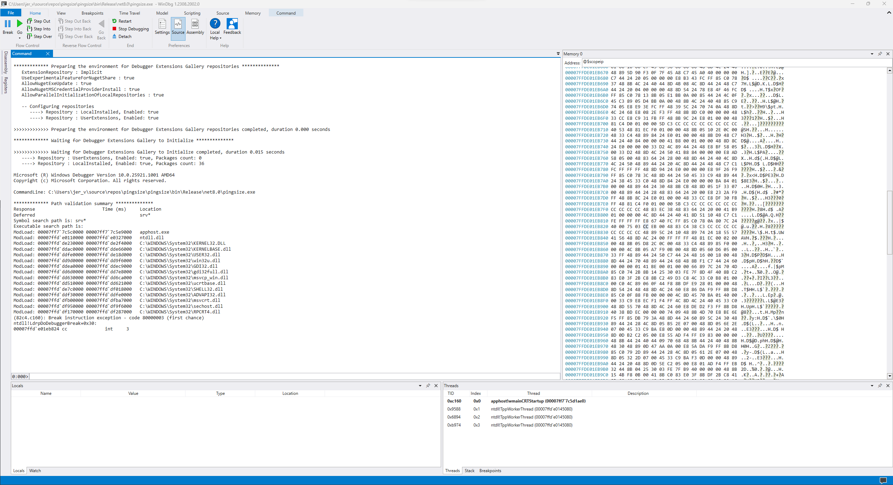
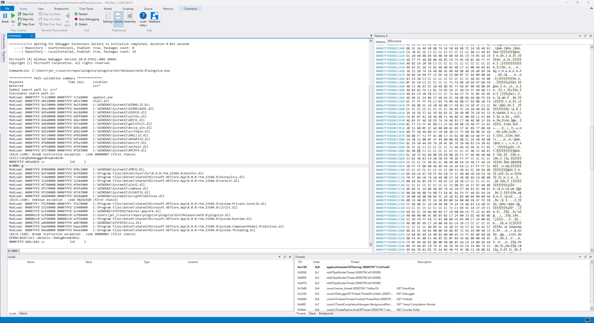
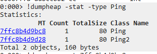

# Background

The yearly ["Performance improvements in .NET" blog post](https://devblogs.microsoft.com/dotnet/performance-improvements-in-net-8) is always a treasure trove of low-level knowledge on performance. This latest edition had several examples of significant improvements as a result of allocating smaller objects, rather than allocating less frequently. Of course no allocations are even better but at the same time allocations are part of life so they are unavoidable to some degree.  
Take [PR #81251](https://github.com/dotnet/runtime/pull/81251) for example: by replacing a couple of fields with a well-known value on an existing `int` field, we can reduce the overall size of each object. After a bit of browsing I spotted [a similar pattern](https://github.com/dotnet/runtime/blob/b6b00ec9f606eca0c47e01b30e74ee0d37d561ab/src/libraries/System.Net.Ping/src/System/Net/NetworkInformation/Ping.cs#L21-L31) in `Ping` where it seemed I would be able to apply the same idea: `bool _canceled` and `bool _disposeRequested` could just as easily be flags for the existing `int _status` field. The `_status` field only supports a few values right now so we can easily tack more on.

After a bit of playing around to figure out how to build the runtime locally and run a comparison benchmark, I ended up with this PR: https://github.com/dotnet/runtime/pull/94151. Lo and behold, BenchmarkDotNet claims we allocated the same amount after my changes. How is that possible when it literally stores less data?

# Diagnosis

At first I looked at the issue through [WinDbg](https://learn.microsoft.com/en-us/windows-hardware/drivers/debugger/debugger-download-tools). To make things easy for ourselves we'll create two class definitions with the fields of the `Ping` class with and without the two booleans:

```csharp
using System.ComponentModel;
using System.Net.NetworkInformation;
using System.Diagnostics;

var a = new Ping();
var b = new Ping2();

Debugger.Break();
public partial class Ping : Component
{
    private readonly ManualResetEventSlim _lockObject = new ManualResetEventSlim(initialState: true); // doubles as the ability to wait on the current operation
    private SendOrPostCallback? _onPingCompletedDelegate;
    private bool _disposeRequested;
    private byte[]? _defaultSendBuffer;
    private CancellationTokenSource? _timeoutOrCancellationSource;
    private bool _canceled;
    private int _status = 0;
    public event PingCompletedEventHandler? PingCompleted;
}

public partial class Ping2 : Component
{
    private readonly ManualResetEventSlim _lockObject = new ManualResetEventSlim(initialState: true); // doubles as the ability to wait on the current operation
    private SendOrPostCallback? _onPingCompletedDelegate;
    private byte[]? _defaultSendBuffer;
    private CancellationTokenSource? _timeoutOrCancellationSource;
    private int _status = 0;
    public event PingCompletedEventHandler? PingCompleted;
}
```

Compile this in release mode (`dotnet build -c Release`) and load the .exe in WinDbg, you'll see something along these lines:



Next, run the program so it hits the breakpoint we set via `Debugger.Break()`:

```bash
g
```



At this point we can look for our previously-created `Ping` objects with something like this:

```bash
!dumpheap -stat -type Ping
```



Immediately we can see that both `Ping` and `Ping2` have one instance each. Crucially, both show up as having a total size of 80 bytes. This aligns with our BenchmarkDotNet findings that no allocation reduction was realised.

To investigate deeper we can click on the link for the `7ffc8b4d9bc8` Method Table which will execute `!dumpheap -mt 7ffc8b4d9bc8`. This then tell us that the memory address for that object is located at `2258d00a648`. 

Clicking that link then executes `!dumpobj /d 2258d00a648` which gives us this nice overview of the object:

```log
0:000> !dumpobj /d 2258d00a648
Name:        Ping
MethodTable: 00007ffc8b4d9bc8
EEClass:     00007ffc8b4e33f8
Tracked Type: false
Size:        80(0x50) bytes
File:        C:\Users\jer_v\source\repos\pingsize\pingsize\bin\Release\net8.0\pingsize.dll
Fields:
              MT    Field   Offset                 Type VT     Attr            Value Name
0000000000000000  4000019        8 ...ponentModel.ISite  0 instance 0000000000000000 _site
0000000000000000  400001a       10 ....EventHandlerList  0 instance 0000000000000000 _events
00007ffc8b355fa0  4000018       98        System.Object  0   static 0000000000000000 s_eventDisposed
00007ffc8b4daa90  4000001       18 ...ualResetEventSlim  0 instance 000002258d00a698 _lockObject
00007ffc8b3992d0  4000002       20          System.Void  0 instance 0000000000000000 _onPingCompletedDelegate
00007ffc8b35d068  4000003       44       System.Boolean  1 instance                0 _disposeRequested
0000000000000000  4000004       28              SZARRAY  0 instance 0000000000000000 _defaultSendBuffer
00007ffc8b3992d0  4000005       30          System.Void  0 instance 0000000000000000 _timeoutOrCancellationSource
00007ffc8b35d068  4000006       45       System.Boolean  1 instance                0 _canceled
00007ffc8b391188  4000007       40         System.Int32  1 instance                0 _status
00007ffc8b3992d0  4000008       38          System.Void  0 instance 0000000000000000 PingCompleted
```

Excellent! Now we see the exact layout of our fields in the object. Worth noting here that the object is 80 bytes -- in decimal. In hexadecimal, that corresponds to 0x50. This is particularly relevant because the `Offset` column specifies its values in hexadecimal as well.

Note that the CLR chooses the most optimal layout for us. We can override this behaviour in structs so beware when using `LayoutKind.Sequential`!

> **Object Layout**  
> 
> At this point we'll take a step back and revise some CLR fundamentals: what does an object look like? For simplicity we'll focus on 64-bit systems here. That means we can assume references are 8 bytes and objects (as a whole) are padded to an 8-byte boundary. Furthermore, every object contains two references by default: the Object Header and a reference to the Method Table. Both are 8 bytes so we know that the resulting object will be at least 16 bytes in size before we've even started counting our fields.
> 
> Interestingly, the Method Header is actually defined with a negative offset (i.e. `-8 bytes`). So our actual object at offset `0` is the Method Table reference.

With this knowledge in mind we can now use the offsets in the above output to show how the object is laid out. To simplify our life, we write a small console script to help with translating hexadecimal to decimal:

```csharp
for (var i = 0; i < 100; i+= 8)
{
    Console.WriteLine($"{i}: {i:x}");
}
Console.Read();
```

This outputs:

```log
0: 0
8: 8
16: 10
24: 18
32: 20
40: 28
48: 30
56: 38
64: 40
72: 48
80: 50
88: 58
96: 60
```

Armed with this information we can deduce the following object layout:

```log
Field                        Offset (hex)  Offset (dec)    Size (bytes)
<Object Header>             -0x08         -8               8
<Method Table Pointer>       0x00          0               8
_site                        0x08          8               8
_events                      0x10          16              8
_lockObject                  0x18          24              8
_onPingCompletedDelegate     0x20          32              8
_defaultSendBuffer           0x28          40              8
_timeoutOrCancellationSource 0x30          48              8
PingCompleted                0x38          56              8
_status                      0x40          64              4
_disposeRequested            0x44          68              1
_canceled                    0x45          69              1
```

> **Object sizes**
>
> References are 8 bytes, but `int` is a 32-bit integer (i.e. four bytes) while booleans are defined as a single byte.

This gives us a total range of `-0x08` to `0x46`, which equates to `0x4e` or 78 bytes. What gives? 

Remember the _Object Layout_ section from above:

> (..) are padded to an 8-byte boundary

78 is not a multiple of 8 so we need to add padding for that. Specifically, we need to add two bytes worth of padding (rounding up to the nearest multiple) so our object actually becomes

```log
Field                        Offset (hex)  Offset (dec)    Size (bytes)
<Object Header>             -0x08         -8               8
<Method Table Pointer>       0x00          0               8
_site                        0x08          8               8
_events                      0x10          16              8
_lockObject                  0x18          24              8
_onPingCompletedDelegate     0x20          32              8
_defaultSendBuffer           0x28          40              8
_timeoutOrCancellationSource 0x30          48              8
PingCompleted                0x38          56              8
_status                      0x40          64              4
_disposeRequested            0x44          68              1
_canceled                    0x45          69              1
<Padding>                    0x46          70              2
```

This now gives us a valid object of 80 bytes. It also immediately makes it clear why our optimisation didn't work: if you remove `_disposeRequested` and `_canceled` from the object definition then we end up with 76 bytes which is also not a multiple of 8. As a result, the CLR will introduce four bytes of padding and end up with an 80-byte object once again.

# Simplified Diagnosis

Spelunking through WinDbg is certainly not trivial! Fortunately, there are projects out there that will help us a long way here. Using the [ObjectLayoutInspector](https://github.com/SergeyTeplyakov/ObjectLayoutInspector) we can inspect the object size at runtime and print out a helpful overview. Add a reference to its NuGet package (`<PackageReference Include="ObjectLayoutInspector" Version="0.1.4" />`) and add the following to our application:

```csharp
ObjectLayoutInspector.TypeLayout.PrintLayout<Ping>();
```

Run the console application and we can see the following output:

```log
Type layout for 'Ping'
Size: 64 bytes. Paddings: 2 bytes (%3 of empty space)
|=======================================================================|
| Object Header (8 bytes)                                               |
|-----------------------------------------------------------------------|
| Method Table Ptr (8 bytes)                                            |
|=======================================================================|
|   0-7: ISite _site (8 bytes)                                          |
|-----------------------------------------------------------------------|
|  8-15: EventHandlerList _events (8 bytes)                             |
|-----------------------------------------------------------------------|
| 16-23: ManualResetEventSlim _lockObject (8 bytes)                     |
|-----------------------------------------------------------------------|
| 24-31: SendOrPostCallback _onPingCompletedDelegate (8 bytes)          |
|-----------------------------------------------------------------------|
| 32-39: Byte[] _defaultSendBuffer (8 bytes)                            |
|-----------------------------------------------------------------------|
| 40-47: CancellationTokenSource _timeoutOrCancellationSource (8 bytes) |
|-----------------------------------------------------------------------|
| 48-55: PingCompletedEventHandler PingCompleted (8 bytes)              |
|-----------------------------------------------------------------------|
| 56-59: Int32 _status (4 bytes)                                        |
|-----------------------------------------------------------------------|
|    60: Boolean _disposeRequested (1 byte)                             |
|-----------------------------------------------------------------------|
|    61: Boolean _canceled (1 byte)                                     |
|-----------------------------------------------------------------------|
| 62-63: padding (2 bytes)                                              |
|=======================================================================|
```

This confirms our WinDbg findings: padding is applied to the end of the object and we're seeing 16 bytes of overhead.

# Conclusion

In this case, padding is inevitable. Even if we were to replace the `int _status` with a `byte _status`, we'd still use a single `byte` on top of the previous boundary and thus incur seven bytes of padding. As a result, moving these fields into the status enum will gain no benefit from an object size perspective. 

This type of optimization shows most promise when used in a type that has multiple fields smaller than the pointer size -- we only see effects if we're able to go down to a lower multiple of our byte boundary. Of course, removing a reference field entirely will always yield results!