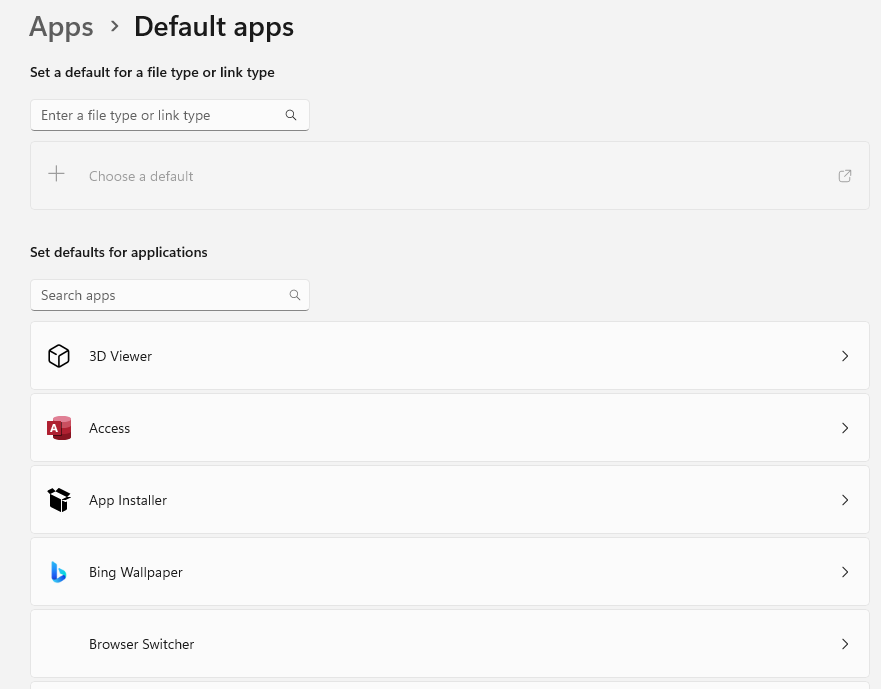
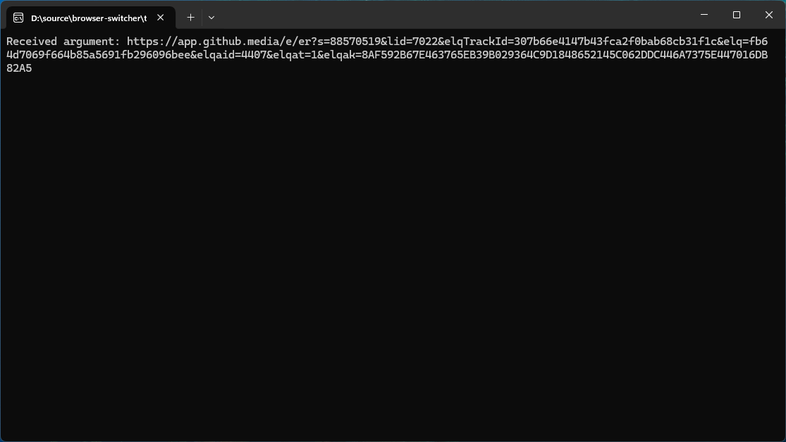
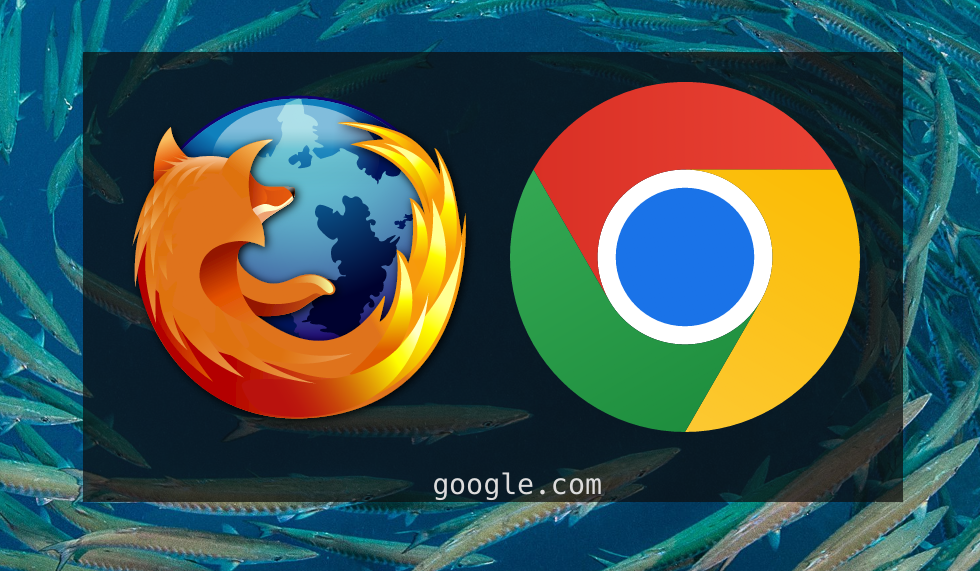

Chrome's recent update to block extensions that use [ManifestV2](https://developer.chrome.com/docs/extensions/develop/migrate/what-is-mv3) spurred me to move over to Firefox. My current setup is relatively complex in the sense that I have seven different Chrome profiles that my household switches between, one of which is my work account. I've decided to start using Firefox for all my personal browsing but I'm not quite yet ready to switch my work flow to it as well. The tricky aspect comes into my dual use: I use my desktop for both personal and work-related things, meaning that at any given point in time I open links to Jira and Github but also Amazon, Octopus Energy and whatever else.

When I'm in Slack or my company's Outlook inbox and click on a link I probably want it to open in Chrome because it's a work thing. However when I'm in my private Outlook inbox or on WhatsApp, I want it to open in Firefox. How do I avoid the frustration of constantly opening links in the wrong application? I decided to create an application that lets me decide which browser to open a link in whenever I click something.

# Browser Switcher
When you click on any link, Windows uses the default browser to open it. The default browser can be configured in your [Default apps](https://support.microsoft.com/en-us/windows/change-default-apps-in-windows-e5d82cad-17d1-c53b-3505-f10a32e1894d) and is probably set to something like Chrome or Firefox already. The idea is straightforward: I want to define my own "browser" which is set as the default and will in turn start either Firefox or Chrome as usual.

As it turns out, registering an application as a browser is rather straightforward: we create [a few entries in the Registry](https://learn.microsoft.com/en-us/windows/win32/shell/start-menu-reg#how-to-register-as-the-default-internet-client) and that will tell Windows an application is available to handle the `http` and `https` protocols. What that looks like is something like this:

```
Windows Registry Editor Version 5.00

; Register app under StartMenuInternet
[HKEY_LOCAL_MACHINE\SOFTWARE\Clients\StartMenuInternet\BrowserSwitcher]
@="Browser Switcher"

[HKEY_LOCAL_MACHINE\SOFTWARE\Clients\StartMenuInternet\BrowserSwitcher\Capabilities]
"ApplicationDescription"="Swap between Chrome and Firefox when opening a link"
"ApplicationName"="Browser Switcher"

[HKEY_LOCAL_MACHINE\SOFTWARE\Clients\StartMenuInternet\BrowserSwitcher\Capabilities\FileAssociations]
".htm"="BrowserSwitcher"
".html"="BrowserSwitcher"
".shtml"="BrowserSwitcher"
".xht"="BrowserSwitcher"
".xhtml"="BrowserSwitcher"

[HKEY_LOCAL_MACHINE\SOFTWARE\Clients\StartMenuInternet\BrowserSwitcher\Capabilities\URLAssociations]
"http"="BrowserSwitcher"
"https"="BrowserSwitcher"

[HKEY_LOCAL_MACHINE\SOFTWARE\Clients\StartMenuInternet\BrowserSwitcher\shell\open\command]
@="\"D:\\source\\browser-switcher\\target\\debug\\browser-switcher.exe\" \"%1\""

; Register with Windows as an application
[HKEY_LOCAL_MACHINE\SOFTWARE\RegisteredApplications]
"BrowserSwitcher"="Software\\Clients\\StartMenuInternet\\BrowserSwitcher\\Capabilities"

; Declare protocol handlers
[HKEY_CLASSES_ROOT\BrowserSwitcher]
@="Browser Switcher"
"URL Protocol"=""

[HKEY_CLASSES_ROOT\BrowserSwitcher\shell\open\command]
@="\"D:\\source\\browser-switcher\\target\\debug\\browser-switcher.exe\" \"%1\""
```

Save this as `setup.reg` and execute the file to load these values into the Registry. You can always check they are correctly loaded by executing `regedit.exe`. With this done we now see something like this in our app settings:



Excellent, Windows recognises our application! Of course right now it's pointing to a path that doesn't exist yet so we'll create a new rust project and print the first argument it receives. Windows uses the `\shell\open\command` paths to execute an application and pass it a single argument: the URL to be opened.

```rust
fn main() {
    let args: Vec<String> = std::env::args().collect();

    if args.len() < 2 {
        eprintln!("Usage: {} <string>", args[0]);
        std::process::exit(1);
    }

    let input = &args[1];
    println!("Received argument: {}", input);

    std::io::stdin().read_line(&mut String::new());
}
```

If we now go into Outlook and click on an arbitrary link we'll see the following output:



Note: make sure to actually set the Browser Switcher as your default application.

Now that this is hooked up the rest is straightforward because we know we can spawn an arbitrary application using `Command::new("path to browser").arg("some url").spawn()` similar to how our own Browser Switcher runs. I've created a small UI using []`egui`](https://github.com/emilk/egui) which will pop up a window with two big buttons: one for Firefox and another for Chrome. Clicking one will open the link in said browser and close the Browser Switcher. The full code for this application can be found in [Github](https://github.com/Vannevelj/browser-switcher).



---

This is all nice and solves a frustration but I realised I could solve another one of my problems here. For years now I have the [Bing Wallpaper](https://www.bing.com/apps/wallpaper) application running to automatically receive a new desktop background each day. A few weeks ago an update came out which meant that once a day when I click on my background, it would open a Bing search for that wallpaper. I looked through all settings and couldn't find anything to turn this behaviour off. Now, I definitely don't use Bing search so with this Browser Switcher solution in place I have an easy entry point to hook into this behaviour and avoid it altogether:

```rust
if input.starts_with("https://www.bing.com/search") {
  std::process::exit(0);
}
```

Rather than waiting for a Microsoft update to allow me to toggle this off, I'm now blocking every link on my system that opens a Bing search. It's unorthodox but it gets the job done.

---

The UI (in its current state) is pretty straightforward and most of the code involved here is about the UI rather than the underlying idea. I have a couple of things I want to improve but functionally it is there.

