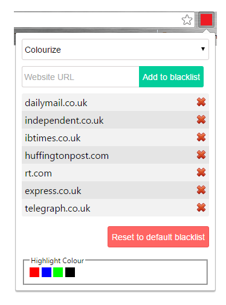

This extension highlights or hides all submissions on reddit.com that point to a crappy clickbait source. It provides a few sources by default and allows the user to add or remove from this list. The user also has the choice between either highlighting the offending post or hiding it altogether.

All settings are stored in sync storage which allows them to be used across chrome instances.

