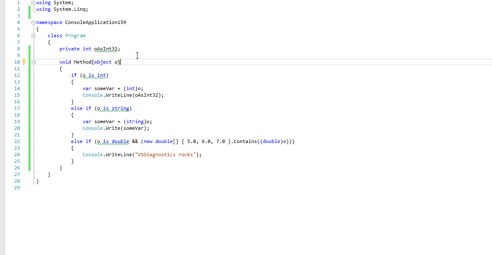

A collection of code-quality analyzers based on the Roslyn compiler platform. This project aims to ensure code-quality as you type it in your editor rather than having to do this as a separate build-step. By performing static analysis while you're writing code, certain convention violations and hidden pitfalls can be avoided as early in the process as possible.

